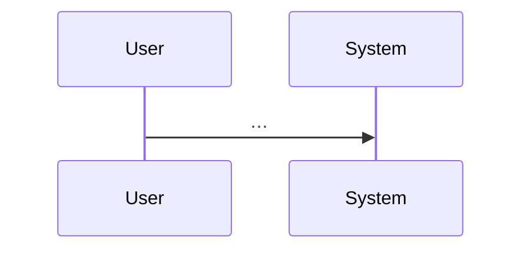

# Feature request — reference templates

Used by **`.cursor/skills/feature-request/SKILL.md`**. Keep templates in **markdown**; issue trackers (Jira, Asana, Linear) can import the tables as-is or copy-paste.

---

## Intake (append to `00-intake.md`)

```markdown
# FR-NNNN — Intake

| Field | Value |
|------|--------|
| **Title** | |
| **Requester** (optional) | |
| **Target timeline** (optional) | e.g. Q3, 6 weeks, before release X |
| **Constraints** | e.g. offline, no new deps, must reuse module X |
| **Success definition** (1–3 bullets) | |
| **Out of scope** | |
| **Links** | design docs, tickets, mocks |

**Raw details** (prose the user or PM provided):
…
```

---

## Design — skeleton (interfaces only)

```markdown
# FR-NNNN — Design (level 0, skeleton)

## Purpose
One paragraph.

## Actors
- …

## Public surfaces (skeleton)
Only contracts: module boundaries, public types, API routes, event names. No implementation.

| Surface | Kind | Contract (signature / schema sketch) | Owner (logical) |
|---------|------|----------------------------------------|-----------------|
| | | | |

## Data in / out
| Input | Output | Storage |
|-------|--------|---------|
| | | |

## Open questions
- …
```

---

## Design — depth ladder

Add sections **L1, L2, …** only as complexity requires:

- **L1:** sequence diagram (mermaid) for main flow; error paths named.
- **L2:** state for each persistent entity; idempotency and concurrency notes.
- **L3:** performance budget (latency, throughput) if user cited scale or SLOs.
- **L4+:** security, migration, roll-back — if applicable.



---

## Tickets + dependency DAG (Jira/Asana-ready)

```markdown
# FR-NNNN — Work breakdown and DAG

## Ticket table

| ID | Title | Type | Deps (ticket IDs) | Summary of change (1–2 lines) | Suggested order group |
|----|--------|------|---------------------|------------------------------|------------------------|
| T-FR-0007-01 | | Story/Task | none / T-FR-0007-02 | | P0 foundation |

**Parallelization rule:** Any two tickets with **disjoint** transitive file/code ownership and **all deps in earlier VAL-done** can run in parallel (same rule as `identify-frontier`).

## DAG (Mermaid)

Use a **second** code fence in the real doc (nesting is invalid inside one template block). Example flowchart:

    flowchart TB
      Taa["T-FR-0007-01: title"]
      Tbb["T-FR-0007-02: title"]
      Taa --> Tbb

## Map to feature **`tickets.md`** + global index

- For each **`T-FR-NNNN-xx`**: add **`###`** sections to **`tasks/feature-history/FR-NNNN-<slug>/tickets.md`** with **Deps:** matching the DAG and **Phases** tables.
- Register the feature path in **`tasks/feature-history/TICKET-SOURCES.md`**.
- Extend **`docs/design/tickets-initial.md`**: feature table row + **global mermaid** edges / **`triadDone`** as needed.
- Add rows to **`tasks/ticket-progress.md`**.

## Suggested `identify-frontier` check

After tickets land, run **`/identify-frontier`** and confirm the **parallel-capable** set matches the DAG (eligible ∩ incomplete).
```

---

## User prompts (copy-paste)

**After design + tickets are written:**

1. "Ready to start implementation: run **`/develop-frontier`** for the current parallel-capable set (or implement serially for a single ticket if you prefer)."
2. "Continue: proceed to the next ticket(s) in dependency order, or re-run **`/identify-frontier`** if the queue changed."
3. "Close this feature’s implementation: run **`/finish-feature`** (merge tickets into **`feat/FR-NNNN-<slug>`**, validate, **PR → `main`**) per **`docs/ai-context.md` §2d** — or **`/finish-frontier`** if integrating ticket branches straight into **`main`**."

---

## Serial diary (append one block per session)

```markdown
## YYYY-MM-DD (session) — <agent or human>

**Stage:** e.g. design L1 / tickets / post-merge

**Recap (plain English):** What we did, what is blocked, what is next.
```

## Parallel agent diary (one file per stream)

`parallel/STREAM-<id>.md` — same format as serial; `STREAM` is worktree slug or **`T-FR-NNNN-xx`** to avoid clobbering other agents.

---

## Feature handoff (`handoffs/YYYY-MM-DD-continue.md`)

```markdown
# FR-NNNN — Continue handoff (YYYY-MM-DD)

**Git:** branch(es) `feat/…`, last known SHAs: …

**Done since last handoff:** …

**Next agent should:** …

**Risks / blockers:** …

**Links:** `serial-diary.md`, `parallel/…`, PRs, `tasks/handoffs/…` (if any)
```

---

## Merged diary stack (`DIARY.md`)

Newest block at **top**. Each block keeps the **raw** sources (**`serial-diary.md`**, **`parallel/foo.md`**) — do **not** delete those files when adding **`DIARY.md`**.

```markdown
# FR-NNNN — Merged diary (stack: newest first)

## YYYY-MM-DD — from `parallel/T-FR-0007-02.md` @ `abc1234`

**Recap:** …

---

## YYYY-MM-DD — from `serial-diary.md` @ `def5678`

**Recap:** …
```
