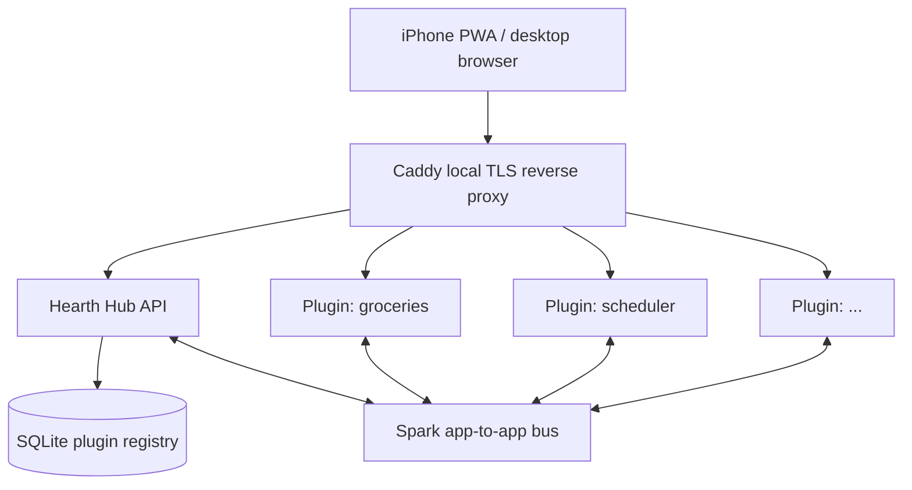

<p align="center">
  
</p>

<h1 align="center">Hearth</h1>

<p align="center">
  <strong>Your home's productivity hub: local-first, plugin-friendly, and built for the iPhone Home Screen.</strong>
</p>

<p align="center">
  <a href="docs/design/architecture/overview.md">Architecture</a>
  ·
  <a href="docs/design/plugin-contract.md">Plugin Contract</a>
  ·
  <a href="docs/design/deployment.md">Deployment</a>
  ·
  <a href="docs/design/roadmap.md">Roadmap</a>
</p>

## Overview

Hearth is a self-hosted personal productivity platform for a Raspberry Pi, Mac mini, or similar always-on home machine. It gives small lifestyle apps, such as groceries, scheduling, recipes, and idea capture, a shared home behind one local URL.

Each app is a plugin with its own code, data, and lifecycle. Hearth provides the hub: reverse proxy routing, plugin discovery, shared UI chrome, local identity, settings, dashboard surfaces, and an app-to-app API.

The primary client is an **iPhone PWA** added to the Home Screen. Desktop browsers and Android are supported through responsive layouts, but the product direction optimizes for the phone-in-hand experience first.

## Status

Hearth has a **runnable Pi + iPhone PWA prototype** on **`main`** (TLS, Mantle shell, Web Push). Platform MVP implementation resumes under [**FR-0001**](tasks/feature-history/FR-0001-hearth-platform/).

- **Done on `main`:** [`FR-0002 iPhone PWA prototype`](tasks/feature-history/FR-0002-iphone-pwa-prototype/) ([PR #3](https://github.com/mcelhennyi/hearth/pull/3)) — operator guide [`SETUP.md`](SETUP.md).
- **Done on `main`:** [`FR-0003 Pi Docker + hearth CLI`](tasks/feature-history/FR-0003-hearth-pi-docker-cli/) ([PR #13](https://github.com/mcelhennyi/hearth/pull/13)).
- **Next:** [`FR-0001 Hearth Platform`](tasks/feature-history/FR-0001-hearth-platform/) — registry, Tinder, Spark, Kindling; reuse FR-0002 hub web/API/Caddy work.
- **Design source of truth:** [`docs/design/`](docs/design/).

## What Hearth Provides

- A single local entrypoint, such as `https://hearth.home.arpa/`, for all enabled plugins.
- A shared React shell, **Mantle**, for navigation, theme, auth surfaces, and PWA behavior.
- A plugin manifest format, **Tinder**, for declaring routes, capabilities, dependencies, and permissions.
- An app-to-app API, **Spark**, for discovery, typed RPC, pub/sub, and dashboard updates.
- Local-first storage with SQLite defaults and plugin-owned data directories.
- Caddy-based local TLS so iPhone PWA features, service workers, and Web Push can work on a LAN.
- A future encrypted relay, **Ember**, for secure access away from home.

## Architecture

At a high level, Hearth runs a hub API, a PWA shell, a reverse proxy, and a registry of plugin services on one home machine.



See the full architecture in [`docs/design/architecture/overview.md`](docs/design/architecture/overview.md).

## Project Constellation

| Name | Role | Status |
| --- | --- | --- |
| **Hearth** | Hub, gateway, plugin loader, registry, dashboard, settings | This repo |
| **Mantle** | Shared React shell and design system | Planned in Kindling |
| **Spark** | Discovery, typed RPC, events, and app-to-app API | Specified in [`docs/design/spark-api.md`](docs/design/spark-api.md) |
| **Tinder** | Plugin manifest and permission contract | Specified in [`docs/design/plugin-contract.md`](docs/design/plugin-contract.md) |
| **Kindling** | Plugin template repo, Mantle package, Spark client, dev tooling | Planned satellite repo |
| **Ember** | Encrypted remote relay and optional backup path | Phase 2 design |

## Tech Stack

| Layer | Choice |
| --- | --- |
| Hub API | Python 3.12, FastAPI, SQLite |
| UI | React 18, TypeScript, Vite |
| Shared shell | Mantle with Tailwind and shadcn/ui |
| Reverse proxy | Caddy 2.x with `tls internal` |
| PWA | Vite-PWA, service worker, manifest, Web Push |
| Plugin API | Spark over local IPC |
| Plugin manifests | Tinder manifest files |
| Dev runtime | Docker Compose |
| Production runtime | systemd on Raspberry Pi, launchd on macOS |

## Getting Started

This repository is not yet installable as an application. For now, the best way to understand or contribute to Hearth is to start with the design docs:

1. Read the [architecture overview](docs/design/architecture/overview.md).
2. Review the [plugin contract](docs/design/plugin-contract.md).
3. Check the [deployment design](docs/design/deployment.md).
4. Follow active implementation work in [`tasks/feature-history/`](tasks/feature-history/).

Once the scaffold lands, development commands will be exposed through:

```bash
./develop help
```

Development commands are expected to run inside Docker Compose by default. Host-local execution should be documented as an exception in ticket diaries.

## Documentation

- [Architecture overview](docs/design/architecture/overview.md)
- [Plugin contract](docs/design/plugin-contract.md)
- [Spark API](docs/design/spark-api.md)
- [Mantle UI](docs/design/mantle-ui.md)
- [Deployment](docs/design/deployment.md)
- [Notifications](docs/design/notifications.md)
- [Roadmap](docs/design/roadmap.md)
- [Satellite repos](docs/design/satellite-repos/)
- [AI workflow notes](docs/ai-context.md)

The logo source lives at [`docs/design/logo.svg`](docs/design/logo.svg). It is intended to move into `apps/hub/web/public/logo.svg` when the hub web scaffold is created.

## Contributing

Hearth is early and design-led. Contributions should follow the documented architecture and ticket workflow rather than introducing behavior that is not backed by `docs/design/`.

Useful places to start:

- Open design questions in [`docs/design/`](docs/design/)
- Active feature history in [`tasks/feature-history/`](tasks/feature-history/)
- Traceability guidance in [`docs/design/documentation-style.md`](docs/design/documentation-style.md)

Inline traceability tags use `@HRT-<AREA>-<NUMBER>`, where areas include `HUB`, `MNTL`, `SPRK`, `TNDR`, `KDLG`, `EMBR`, `IDM`, `OPS`, and `DOC`.

## Repository Skeleton

This repository was initialized from the [process skeleton](.skeleton/INIT.MD). Template sources live in `.skeleton/` as a git submodule. Run `./sync-skeleton` only when intentionally applying upstream process or tooling updates.

## License

Hearth is not licensed for public reuse yet. Add an open-source license before the first public release.
