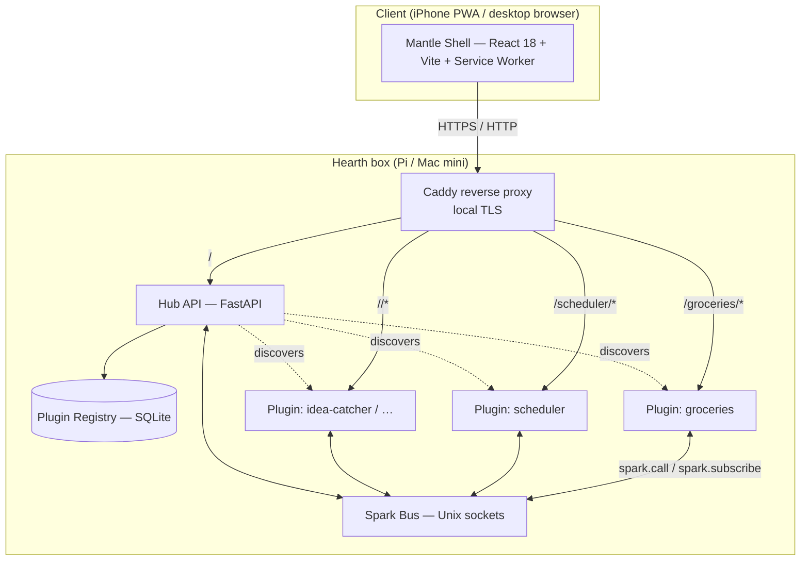
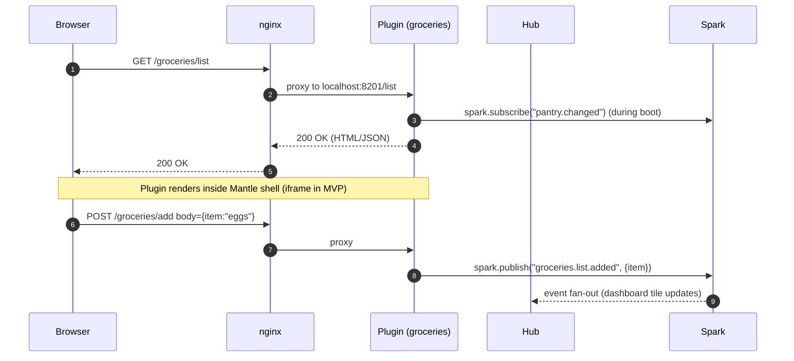
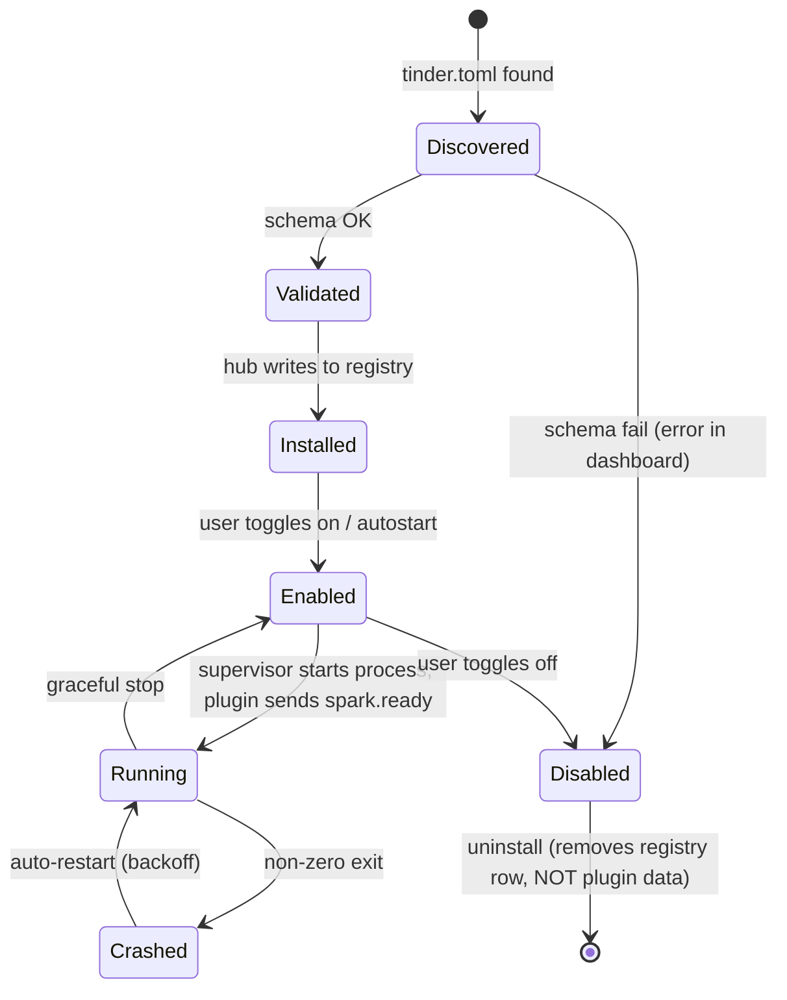
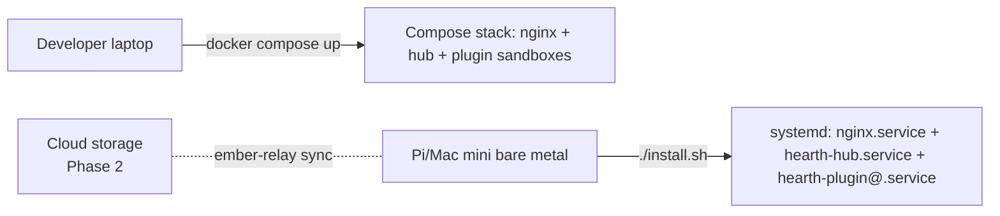

# Hearth — architecture overview

**Status:** authoritative for MVP (FR-0001). Companion phase-2 relay design lives in [`docs/design/satellite-repos/ember.md`](../satellite-repos/ember.md). Process / workflow rules are in [`docs/ai-context.md`](../../ai-context.md), not duplicated here.

## 1. What Hearth is

A self-hosted hub that runs on a single machine at home (Raspberry Pi 4/5 or Mac mini) and presents a single URL — `https://hearth.local/` — that fronts a growing set of small "lifestyle" apps. Each app is its own project ("plugin") that opts into Hearth via a manifest, and apps can call each other through a typed RPC layer. The hub itself is intentionally minimal: routing, plugin registry, identity, dashboard, settings.

The **primary client surface is an iPhone PWA** added to the Home Screen, not a desktop browser. Mantle ships a `manifest.json` and a service worker so the shell launches in `display: standalone` (no Safari chrome) and behaves like a native app. Desktop browsers still work; the layout is responsive (top bar on wide screens, bottom-tab nav on narrow ones).

## 2. Big picture



## 3. Components

| Component | Tech | Responsibility |
|-----------|------|----------------|
| **Hub API** (`apps/hub/api/`) | Python 3.12, FastAPI, SQLite, `uvicorn` | Plugin registry, lifecycle (`enable`, `disable`, `health`), nginx-config generation, dashboard data aggregation, settings CRUD, identity (single local user for MVP). |
| **Mantle shell** (`apps/hub/web/`, package from Kindling) | React 18, TypeScript, Vite, Tailwind, shadcn/ui | The chrome — top nav, theme tokens, plugin frame, auth widget, notification slot. Plugins import the Mantle package for shared primitives. |
| **Plugins** (`apps/<slug>/`) | Plugin's choice; default Python+React via Kindling | Self-contained app: own backend process, own UI, own data store. Declares routes + capabilities + permissions in `tinder.toml`. |
| **Spark bus** (`apps/hub/api/spark/`) | Python `asyncio`, Unix domain sockets, length-prefixed JSON frames | Inter-plugin RPC + pub/sub. Sockets at `var/hearth/run/spark.sock` (broker) and `var/hearth/run/<slug>.sock` (per-plugin). |
| **Tinder loader** (`apps/hub/api/tinder/`) | Python | Reads `apps/<slug>/tinder.toml`, validates schema, populates registry, materializes proxy config and Spark routing. |
| **Reverse proxy** | **Caddy 2.x** by default (automatic local TLS via `tls internal`); **nginx** as a documented alternative | Routes HTTPS, issues a local CA cert for `hearth.local`, terminates basic auth in MVP. iPhone PWAs require HTTPS — Caddy gets us there with no manual cert work. |
| **Process supervisor** | Docker Compose (dev), systemd (prod) | Owns plugin lifecycles. Hub asks the supervisor to start/stop a plugin via a thin adapter (`apps/hub/api/supervisor/`). |
| **Storage** | SQLite (`var/hearth/hearth.db`) for hub; per-plugin store under `var/hearth/plugins/<slug>/` | Plugins own their data; hub never reads plugin data files directly. |

## 4. Data flow — request to plugin



## 5. Plugin lifecycle



## 6. Inter-plugin communication (Spark)

Plugins do **not** call each other's HTTP routes. They use Spark, which:

1. Discovers capabilities via the Tinder manifests held in the registry.
2. Routes a `spark.call("<plugin>", "<method>", payload)` over Unix sockets to the named plugin's socket.
3. Fans out `spark.publish("<topic>", payload)` to every subscriber.

A capability surface is published by each plugin in `tinder.toml`:

```toml
[capabilities.list]
methods = ["add", "remove", "items"]
events  = ["added", "removed"]
```

Full schema and error envelope: [`docs/design/spark-api.md`](../spark-api.md).

## 7. Deployment topology



- **Dev:** Docker Compose with hot-reload for hub, mounted plugin folders, single-process nginx. Plugins run as additional Compose services scaffolded by Kindling.
- **Prod:** systemd units. nginx as a system package. Hub owns `var/hearth/` (data, sockets, generated nginx fragments). `install.sh` wires it up and prompts for the local user password.
- **Phase 2:** Ember relay (separate FR) speaks to the hub over an outbound persistent connection so users can reach `https://<id>.ember.example/` from anywhere with end-to-end encryption.

## 8. Identity (MVP)

- **One local user**, local password (Argon2id), session cookie issued by hub.
- Plugins do not implement their own login — they trust a signed `X-Hearth-User` header injected by nginx (set from a sub-request to the hub's `/auth/verify`).
- Phase 2: Ember relay issues device-bound tokens; same header contract on the inside.

## 9. Persistence

| Store | Path | Owned by | Backed up |
|-------|------|----------|-----------|
| Hub registry | `var/hearth/hearth.db` | Hub | Always (it is the truth about installed plugins) |
| Plugin data | `var/hearth/plugins/<slug>/` | Plugin | Plugin opts in via Tinder `[backup]` block |
| Secrets | `var/hearth/secrets/` (mode 0600) | Hub + admin | Never via cloud; only to encrypted local backups |

Backup strategy lives in [`docs/design/deployment.md`](../deployment.md). MVP exports a tarball; Ember and the later native [`system-backup`](../plugin-ideas/system-backup.md) plugin idea cover encrypted cloud sync.

## 10. Non-goals (MVP)

- Multi-user, role-based permissions.
- Federation / clustering across multiple Hearth boxes.
- A plugin marketplace, ratings, or paid plugins.
- Realtime ML / heavy media transcode (the C++ door is open but unscaffolded).
- Mining / token economics for the Ember relay — flagged in the Phase-3 roadmap as a research item, not a design commitment.

## 11. Forward look

[`docs/design/roadmap.md`](../roadmap.md) sketches Phase 2 (Ember relay, cloud-backed encrypted backup, multi-device pairing) and Phase 3 (notifications, AI recommendations, automation/workflows, plugin store, gamification, optional crypto/mining experiment). They are explicitly outside FR-0001's acceptance.
