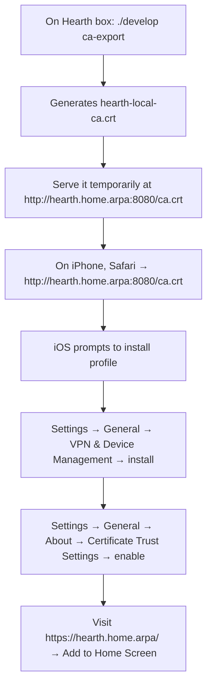

# Deployment

**Authority:** This document defines how Hearth is run during development and on a Pi/Mac mini in MVP.

The reverse proxy is **Caddy 2.x by default** because Caddy's `tls internal` issues a locally-trusted TLS certificate with zero configuration. iPhone PWAs require HTTPS for the manifest, service worker, and Web Push, so a no-fuss local TLS path is the difference between "works the day you install it" and "you'll get to it next weekend." nginx is a documented alternative for environments that prefer it.

## Targets

| Target | Mode | Notes |
|--------|------|-------|
| Developer laptop (macOS, Linux) | **Docker Compose** | Hot-reload hub, mounted plugin folders, in-tree Caddy with template config |
| Raspberry Pi 4/5, 64-bit Raspberry Pi OS | **systemd, bare metal** | Caddy as a system package, hub + plugins as `.service` units |
| Mac mini (Apple Silicon, macOS) | **launchd** wrappers around the same binaries | Same layout under `/usr/local/var/hearth/` |

## Reverse proxy — Caddy by default

`Caddyfile` (generated from the registry, written to `/etc/hearth/Caddyfile.fragment` and `import`-ed from a tiny `/etc/caddy/Caddyfile`):

```caddyfile
{
    # local CA — Caddy issues hearth.home.arpa certs trusted only by hosts that
    # install the local CA root (see "iPhone trust workflow" below)
    local_certs
}

hearth.home.arpa {
    tls internal

    # Web Push requires the PWA scope to be at /
    handle_path /api/* {
        reverse_proxy hub:8200
    }
    handle_path /spark-events {
        reverse_proxy hub:8200    # SSE for the shell's status strip
    }

    # generated per-plugin blocks (one import per plugin)
    import /etc/hearth/Caddyfile.plugins

    # everything else: hub UI (the Mantle PWA shell)
    reverse_proxy hub:8200
}
```

Per-plugin block (one per enabled plugin, written by the hub):

```caddyfile
handle_path /groceries/* {
    reverse_proxy groceries:8201
}
```

`caddy reload` is invoked by a small privileged helper (or PolicyKit on Pi, `launchctl` on Mac) — the hub itself does not run as root.

### nginx alternative

If a deployment opts into nginx, the hub generates `/etc/nginx/conf.d/hearth-plugins.conf` with `proxy_pass` lines and TLS via `mkcert`-issued certs. Same registry-derived config, different syntax. This is documented in `deploy/nginx/README.md` (post-MVP unless someone asks).

## iPhone trust workflow (one-time per device)

Web Push and the service worker need a TLS cert the iPhone trusts. With Caddy `tls internal`, there is a local CA root we can install on the phone:



`./develop ca-export` is a tiny wrapper around `caddy file-server -listen :8080 -root /tmp/hearth-ca/` that times out after 10 minutes. It is documented in the dashboard's "Add a device" tile.

## Filesystem layout (prod)

```
/opt/hearth/                          (read-only code)
  apps/hub/...
  apps/<slug>/...        (vendored as git submodules of the deploy repo)
/etc/hearth/
  hearth.toml            (machine-local config: hostname, ports, push VAPID keys, …)
  Caddyfile.fragment     (generated; included from /etc/caddy/Caddyfile)
  Caddyfile.plugins      (generated; one import block per enabled plugin)
  plugins.d/             (symlinks for drop-in plugins)
/var/hearth/             (mutable; backed up)
  hearth.db
  plugins/<slug>/        (per-plugin data dirs)
  run/                   (Unix sockets — not backed up)
  log/
  secrets/               (mode 0600 — VAPID keys, local user password hash, …)
```

On macOS: prefix `/opt` and `/var` with `/usr/local` and `/etc` with `/usr/local/etc`. The install script abstracts this.

## systemd units (prod)

| Unit | Description |
|------|-------------|
| `hearth-hub.service`              | Hub API + Spark broker, single instance |
| `hearth-plugin@<slug>.service`    | One instance per enabled plugin; hub `enable` calls `systemctl start hearth-plugin@<slug>` |
| `caddy.service`                   | System package; reload on registry change via privileged helper |

The hub `--regenerate-proxy` subcommand writes both Caddyfile fragments and runs `systemctl reload caddy`.

## Compose stack (dev)

`deploy/compose/docker-compose.yml`:

```yaml
services:
  caddy:
    image: caddy:2.8
    ports: ["80:80", "443:443"]
    volumes:
      - ./Caddyfile.dev:/etc/caddy/Caddyfile:ro
      - caddy_data:/data           # local CA persists across rebuilds
      - caddy_config:/config
    depends_on: [hub]

  hub:
    build: ../../apps/hub/api
    command: ["uvicorn", "hub.app:app", "--reload", "--host", "0.0.0.0", "--port", "8200"]
    volumes:
      - ../../apps/hub/api:/app
      - ../../var/hearth:/var/hearth
    environment:
      HEARTH_DEV: "1"
      HEARTH_HOSTNAME: "hearth.home.arpa"

  # plugin services scaffolded by `kindling new <slug>` and added to a generated override file

volumes:
  caddy_data:
  caddy_config:
```

`./develop` wraps `docker compose` to:

- `./develop up` — start the stack with hot-reload.
- `./develop new-plugin <slug>` — calls `kindling new <slug>`, registers it, restarts only that plugin service.
- `./develop logs <slug>` — tail one plugin.
- `./develop test [path]` — run pytests inside the hub container.
- `./develop ca-export` — start a 10-minute file server for the local CA cert (iPhone trust step).

## Install script (prod)

`deploy/install.sh` is the only thing a user runs on a fresh Pi/Mac mini:

```mermaid
flowchart TD
  A[curl install.sh | bash] --> B{Detect OS}
  B -->|Linux| C[apt: caddy, python3.12, sqlite, …]
  B -->|macOS| D[brew: caddy, python@3.12, …]
  C --> E[Clone deploy repo to /opt/hearth]
  D --> E
  E --> F[Create system user 'hearth']
  F --> G[Create /var/hearth and /etc/hearth]
  G --> H[Install systemd / launchd units]
  H --> I[Generate VAPID keypair for Web Push]
  I --> J[Prompt for local user password]
  J --> K[Generate initial hearth.toml + Caddyfile]
  K --> L[Start hearth-hub + caddy]
  L --> M[Print: https://hearth.home.arpa/ and 'next: trust the local CA on your iPhone']
```

The script is idempotent — running it again upgrades in place.

## Backup

MVP exports a single tarball:

```
hearth-backup-YYYYMMDD-HHMM.tar.zst
├── hearth.db
├── plugins/<slug>/...   (only paths in each plugin's tinder.toml [backup].include, minus excludes)
└── secrets/             (encrypted with the user's local password if `--encrypt` passed)
```

Restore is `hearth restore <file>` from a clean install.

Phase 2 (Ember) or a later native backup plugin replaces this with continuous encrypted sync to a cloud-storage adapter (Google Drive, S3-compatible, …) — see [`satellite-repos/ember.md`](satellite-repos/ember.md) and [`plugin-ideas/system-backup.md`](plugin-ideas/system-backup.md).

## Updates

- **Hub itself** — `git pull` in `/opt/hearth`, `systemctl restart hearth-hub`. Migrations run on startup against `hearth.db`.
- **Plugins** — managed via the dashboard ("Update available" pulls from each plugin submodule's remote). Plugin schema migrations are the plugin's responsibility.
- **Skeleton process files** — `./sync-skeleton` from the repo root pulls upstream tooling updates; this affects developers, not deployed boxes.

## Resource expectations (MVP)

| Box | Hub idle | + 5 plugins idle | Notes |
|-----|----------|------------------|-------|
| Pi 4 (4 GB) | ~80 MB RSS | ~250 MB RSS | within budget; Caddy adds ~30 MB |
| Pi 5 (8 GB) | ~80 MB RSS | ~250 MB RSS | comfortable; can host C++ services later |
| Mac mini M2 (8 GB+) | negligible | negligible | dev experience matches deploy |

No GPU assumed.

## Security defaults (MVP)

- **HTTPS only** via Caddy `tls internal`. Plain HTTP is redirected.
- **Bind to LAN only by default** — Caddy listens on `0.0.0.0` but the host firewall (ufw on Pi, pf on Mac) is configured to drop WAN. WAN exposure is intentionally Phase-2 (Ember), not via port-forwarding.
- **Basic auth required** unless `HEARTH_TRUST_LAN=1` (FR-0001 README open question Q4 — default is "auth required").
- **Plugin processes run as the `hearth` system user**, not root.
- **No outbound traffic from plugins** unless `permissions.network` requested in `tinder.toml` and the hub policy allows it. Web Push outbound to `*.push.apple.com` and the Google FCM endpoints is allowed only for the hub.
