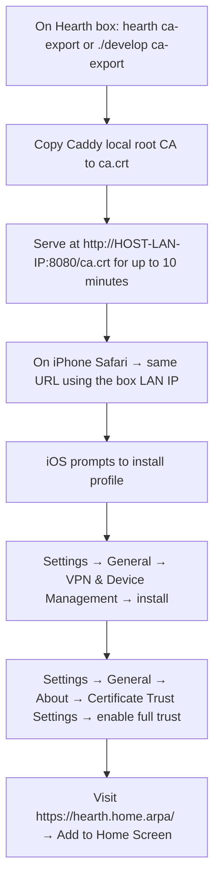
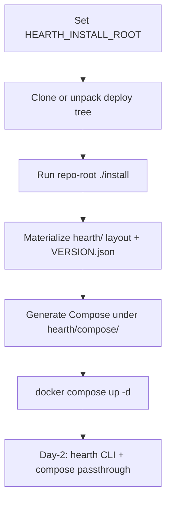

# Deployment

**Authority:** This document defines how Hearth is run during development and on a Pi/Mac mini in MVP.

Production on **Raspberry Pi-class** hosts allows **two** profiles: **Docker Compose + `hearth` CLI** (**FR-0003**, see `tasks/feature-history/FR-0003-hearth-pi-docker-cli/README.md`) or **systemd + bare metal** via **`deploy/install.sh`** (**`T-FR-0001-10`**, `tasks/feature-history/FR-0001-hearth-platform/tickets.md`). Pick **one** supervisor story per machine for hub/plugins (do not double-run the same tier).

The reverse proxy is **Caddy 2.x by default** because Caddy's `tls internal` issues a locally-trusted TLS certificate with zero configuration. iPhone PWAs require HTTPS for the manifest, service worker, and Web Push, so a no-fuss local TLS path is the difference between "works the day you install it" and "you'll get to it next weekend." nginx is a documented alternative for environments that prefer it.

## Targets

| Target | Mode | Notes |
|--------|------|-------|
| Developer laptop (macOS, Linux) | **Docker Compose** | Hot-reload hub, mounted plugin folders, in-tree Caddy with template config |
| Raspberry Pi 4/5, 64-bit Raspberry Pi OS | **Docker Compose + `hearth`** | Install under `<install-dir>/hearth/`; repo-root **`./install`** + **`hearth`** CLI — see [Docker profile (Pi)](#docker-profile-pi) |
| Raspberry Pi 4/5 (same OS) | **systemd, bare metal** (alternative) | **`deploy/install.sh`**: Caddy as a system package, hub + plugins as `.service` units |
| Mac mini (Apple Silicon, macOS) | **launchd** wrappers around the same binaries | Same layout under `/usr/local/var/hearth/` (bare-metal path; Docker-on-Mac mini may follow the same `hearth/` mapping later) |

## Reverse proxy — Caddy by default

`Caddyfile` (generated from the registry, written to `/etc/hearth/Caddyfile.fragment` and `import`-ed from a tiny `/etc/caddy/Caddyfile`):

```caddyfile
{
    # local CA — Caddy issues hearth.home.arpa certs trusted only by hosts that
    # install the local CA root (see "iPhone trust workflow" below)
    local_certs
}

hearth.home.arpa {
    tls internal

    # Web Push requires the PWA scope to be at /
    handle_path /api/* {
        reverse_proxy hub:8200
    }
    handle_path /spark-events {
        reverse_proxy hub:8200    # SSE for the shell's status strip
    }

    # generated per-plugin blocks (one import per plugin)
    import /etc/hearth/Caddyfile.plugins

    # everything else: hub UI (the Mantle PWA shell)
    reverse_proxy hub:8200
}
```

Per-plugin block (one per enabled plugin, written by the hub):

```caddyfile
handle_path /groceries/* {
    reverse_proxy groceries:8201
}
```

On the **bare-metal** paths above, `caddy reload` is invoked by a small privileged helper (or PolicyKit on Pi, `launchctl` on Mac) — the hub itself does not run as root. In the **Docker profile**, Caddy (when included in Compose) reloads inside the container stack; policy matches dev Compose, not `systemctl`.

### nginx alternative

If a deployment opts into nginx, the hub generates `/etc/nginx/conf.d/hearth-plugins.conf` with `proxy_pass` lines and TLS via `mkcert`-issued certs. Same registry-derived config, different syntax. This is documented in `deploy/nginx/README.md` (post-MVP unless someone asks).

## iPhone trust workflow (one-time per device)

Web Push and the service worker need a TLS cert the iPhone trusts. With Caddy `tls internal`, there is a local CA root we can install on the phone:



**DNS (before trust):** Every iPhone must resolve **`hearth.home.arpa`** to the Hearth host on the LAN (Pi-hole local DNS record is the recommended approach; Mac `/etc/hosts` does not help phones). See repo-root **`SETUP.md`** §5.

**Operators (Docker profile):** run **`hearth ca-export`** from an install with the FR-0002 stack (see repo-root **`SETUP.md`** §6). **Developers (repo checkout):** run **`./develop ca-export`**. Both serve the root CA over plain HTTP on port **8080**; use the host **LAN IP**, not `localhost`, on the phone. **Profile install alone is not enough on iOS** — step **G** (Certificate Trust Settings) is required or Safari reports "This Connection Is Not Private." The export times out after 10 minutes. Documented for the dashboard "Add a device" tile in a later FR.

## Filesystem layout (prod)

This tree is the **bare-metal** layout: paths under `/opt`, `/etc`, and `/var` as shown. The **Docker profile** keeps the same *roles* under **`<install-dir>/hearth/`** (see [Docker profile (Pi)](#docker-profile-pi)); nothing in this section implies systemd is the only Pi option.

```
/opt/hearth/                          (read-only code)
  apps/hub/...
  apps/<slug>/...        (vendored as git submodules of the deploy repo)
/etc/hearth/
  hearth.toml            (machine-local config: hostname, ports, push VAPID keys, …)
  Caddyfile.fragment     (generated; included from /etc/caddy/Caddyfile)
  Caddyfile.plugins      (generated; one import block per enabled plugin)
  plugins.d/             (symlinks for drop-in plugins)
/var/hearth/             (mutable; backed up)
  hearth.db
  plugins/<slug>/        (per-plugin data dirs)
  run/                   (Unix sockets — not backed up)
  log/
  secrets/               (mode 0600 — VAPID keys, local user password hash, …)
```

On macOS: prefix `/opt` and `/var` with `/usr/local` and `/etc` with `/usr/local/etc`. The install script abstracts this.

## Docker profile (Pi)

<!-- AMENDMENT: HRT-DEP-001 -->
<!-- Author: Cursor agent (design amendment) -->
<!-- Date: 2026-05-16 -->
<!-- Reason: Align install-tree directory name with product name. Early FR-0003 drafts used ``heart/`` under ``<install-dir>``; authoritative layout is now ``<install-dir>/hearth/``. Code, schemas, and tickets match this name. Existing Pi installs created before this amendment used ``heart/`` — re-run ``./install`` on a fresh install root or rename ``heart/`` → ``hearth/`` and update ``HEARTH_INSTALL_ROOT`` references before upgrading. -->
<!-- /AMENDMENT -->

**Supervisor:** **Docker Compose** runs the hub, plugins, and (typically) Caddy **in containers**. **`systemd` does not** supervise hub/plugin processes in this profile — compare [systemd units (prod, bare-metal alternative)](#systemd-units-prod-bare-metal-alternative). Day-2 lifecycle is the **`hearth`** CLI (contracts in `tasks/feature-history/FR-0003-hearth-pi-docker-cli/10-design-00-skeleton.md`; feature overview in `tasks/feature-history/FR-0003-hearth-pi-docker-cli/README.md`).

**Operator:** Expect **non-root** use with **`docker` group** membership; install root is chosen at bootstrap (**`HEARTH_INSTALL_ROOT`**, defaulting to a documented convention — often `$HOME` or `/opt` — see skeleton open questions).

**Bootstrap** (contracts in FR-0003 tickets; **`./install`** implementation follows **`T-FR-0003-03`**):



**Filesystem mapping (`hearth/` vs bare-metal paths):**

| `hearth/` subtree | Role | Bare-metal analogue (above) |
|------------------|------|-----------------------------|
| Checkout under **`hearth/`** (deploy repo + plugins) | Read-only deploy tree | `/opt/hearth/` |
| **`hearth/var/`** | Mutable DB, per-plugin data, logs, `run/` | `/var/hearth/` |
| **`hearth/state/`**, generated proxy fragments, registry files | Machine-local config and derived files | `/etc/hearth/` |
| **`hearth/compose/`** | Compose project + generated plugin overrides | *(native units + `/etc/caddy` instead on bare metal)* |
| **`hearth/plugins/<slug>/`** | Plugin source checkouts | `/opt/hearth/apps/<slug>/` (submodule shape) |
| **`hearth/VERSION.json`** | Install manifest (schema v1; JSON Schema [`deploy/hearth-install/schemas/version-1.schema.json`](../../deploy/hearth-install/schemas/version-1.schema.json)) — **`T-FR-0003-02`** | *(no single analogue; bare metal uses git checkout under `/opt/hearth`)* |
| **`hearth/state/plugins.yaml`** (or `.json`) | Local plugin registry for Compose generation — **`T-FR-0003-05`** | Split between hub DB + `/etc/hearth` on bare metal; Docker profile stays **file-first** until hub sync exists |
| **`hearth/bin/`** | `hearth` shim on `PATH` (install policy) — **`T-FR-0003-04`** | `/usr/local/bin` or equivalent from **`deploy/install.sh`** |

**Updates:** **`hearth --update`** (with optional **`--dry-run`**) runs **`git pull --ff-only`** at the deploy checkout root, refreshes enabled plugin git checkouts per **`hearth/state/plugins.yaml`** (`git pull --ff-only` or **`git checkout <pinned_ref>`** when set), regenerates **`compose/overrides/generated.plugins.yml`**, optionally runs an executable **`hearth/bin/hearth-migrate`** when the hub supplies one, then **`docker compose up -d --pull always`** for the install Compose project. **`VERSION.json` `hearth_ref`** is rewritten when the deploy HEAD changes after the pull.

**DESIGN-GAP — Docker profile (explicit):**

- **Published ARM images** — Release hub/plugin images for Pi may need a registry and CI publishing pipeline; **local image build** remains valid until that exists.
- **Rootless Docker** — Install docs assume a working Docker socket for the operator account; rootless Docker specifics are **unspecified**.
- **Plugin add by friendly name** — MVP remains **git URL** (and optional local path); central registry / relay naming is **out of scope** until the relay exists (`tasks/feature-history/FR-0003-hearth-pi-docker-cli/10-design-00-skeleton.md`).

**MVP policy (not a gap):** Plugin add and registry edits stay **file-first** on this profile until an explicit hub sync story exists (skeleton “Hub API duplication” — convergence with **`T-FR-0001-02`** is deferred).

## systemd units (prod, bare-metal alternative)

These units apply only to the **`deploy/install.sh`** / native-binary path — **not** to the Docker-on-Pi supervisor.

| Unit | Description |
|------|-------------|
| `hearth-hub.service`              | Hub API + Spark broker, single instance |
| `hearth-plugin@<slug>.service`    | One instance per enabled plugin; hub `enable` calls `systemctl start hearth-plugin@<slug>` |
| `caddy.service`                   | System package; reload on registry change via privileged helper |

The hub `--regenerate-proxy` subcommand writes both Caddyfile fragments and runs `systemctl reload caddy`.

## Compose stack (dev)

The **shape** of this stack (Caddy + hub + plugins) is the reference for **Compose supervision**; the **Docker profile (Pi)** uses install-local paths under **`hearth/compose/`** and release images instead of dev bind-mounts. See [Docker profile (Pi)](#docker-profile-pi).

`deploy/compose/docker-compose.yml`:

```yaml
services:
  caddy:
    image: caddy:2.8
    ports: ["80:80", "443:443"]
    volumes:
      - ./Caddyfile.dev:/etc/caddy/Caddyfile:ro
      - caddy_data:/data           # local CA persists across rebuilds
      - caddy_config:/config
    depends_on: [hub]

  hub:
    build: ../../apps/hub/api
    command: ["uvicorn", "hub.app:app", "--reload", "--host", "0.0.0.0", "--port", "8200"]
    volumes:
      - ../../apps/hub/api:/app
      - ../../var/hearth:/var/hearth
    environment:
      HEARTH_DEV: "1"
      HEARTH_HOSTNAME: "hearth.home.arpa"

  # plugin services scaffolded by `kindling new <slug>` and added to a generated override file

volumes:
  caddy_data:
  caddy_config:
```

`./develop` wraps `docker compose` to:

- `./develop up` — start the stack with hot-reload.
- `./develop new-plugin <slug>` — calls `kindling new <slug>`, registers it, restarts only that plugin service.
- `./develop logs <slug>` — tail one plugin.
- `./develop test [path]` — run pytests inside the hub container.
- `./develop ca-export` — start a 10-minute file server for the local CA cert (iPhone trust step).

## Install script (prod, bare metal)

**Docker-on-Pi** uses the FR-0003 repo-root **`./install`** bootstrap (see [Docker profile (Pi)](#docker-profile-pi); feature README `tasks/feature-history/FR-0003-hearth-pi-docker-cli/README.md`), not this shell script.

**Bare-metal Pi / Mac mini:** `deploy/install.sh` is the entrypoint shipped by **`T-FR-0001-10`** (`tasks/feature-history/FR-0001-hearth-platform/tickets.md`):

```mermaid
flowchart TD
  A[curl install.sh | bash] --> B{Detect OS}
  B -->|Linux| C[apt: caddy, python3.12, sqlite, …]
  B -->|macOS| D[brew: caddy, python@3.12, …]
  C --> E[Clone deploy repo to /opt/hearth]
  D --> E
  E --> F[Create system user 'hearth']
  F --> G[Create /var/hearth and /etc/hearth]
  G --> H[Install systemd / launchd units]
  H --> I[Generate VAPID keypair for Web Push]
  I --> J[Prompt for local user password]
  J --> K[Generate initial hearth.toml + Caddyfile]
  K --> L[Start hearth-hub + caddy]
  L --> M[Print: https://hearth.home.arpa/ and 'next: trust the local CA on your iPhone']
```

The script is idempotent — running it again upgrades in place.

## Backup

MVP exports a single tarball:

```
hearth-backup-YYYYMMDD-HHMM.tar.zst
├── hearth.db
├── plugins/<slug>/...   (only paths in each plugin's tinder.toml [backup].include, minus excludes)
└── secrets/             (encrypted with the user's local password if `--encrypt` passed)
```

Restore is `hearth restore <file>` from a clean install.

Phase 2 (Ember) or a later native backup plugin replaces this with continuous encrypted sync to a cloud-storage adapter (Google Drive, S3-compatible, …) — see [`satellite-repos/ember.md`](satellite-repos/ember.md) and [`plugin-ideas/system-backup.md`](plugin-ideas/system-backup.md).

## Updates

- **Hub itself (bare metal)** — `git pull` in `/opt/hearth`, `systemctl restart hearth-hub`. Migrations run on startup against `hearth.db`.
- **Hub + stack (Docker profile)** — **`hearth --update`** (or equivalent documented in FR-0003) refreshes the deploy checkout / images and reapplies Compose; no `systemctl` on that path.
- **Plugins** — managed via the dashboard ("Update available" pulls from each plugin submodule's remote). Plugin schema migrations are the plugin's responsibility.
- **Skeleton process files** — `./sync-skeleton` from the repo root pulls upstream tooling updates; this affects developers, not deployed boxes.

## Resource expectations (MVP)

| Box | Hub idle | + 5 plugins idle | Notes |
|-----|----------|------------------|-------|
| Pi 4 (4 GB) | ~80 MB RSS | ~250 MB RSS | within budget; Caddy adds ~30 MB |
| Pi 5 (8 GB) | ~80 MB RSS | ~250 MB RSS | comfortable; can host C++ services later |
| Mac mini M2 (8 GB+) | negligible | negligible | dev experience matches deploy |

No GPU assumed.

## Security defaults (MVP)

- **HTTPS only** via Caddy `tls internal`. Plain HTTP is redirected.
- **Bind to LAN only by default** — Caddy listens on `0.0.0.0` but the host firewall (ufw on Pi, pf on Mac) is configured to drop WAN. WAN exposure is intentionally Phase-2 (Ember), not via port-forwarding.
- **Basic auth required** unless `HEARTH_TRUST_LAN=1` (FR-0001 README open question Q4 — default is "auth required").
- **Plugin processes** — on **bare metal**, they run as the **`hearth` system user**, not root; on **Docker profile**, they run as the container user mapped by Compose (non-root by policy).
- **No outbound traffic from plugins** unless `permissions.network` requested in `tinder.toml` and the hub policy allows it. Web Push outbound to `*.push.apple.com` and the Google FCM endpoints is allowed only for the hub.
