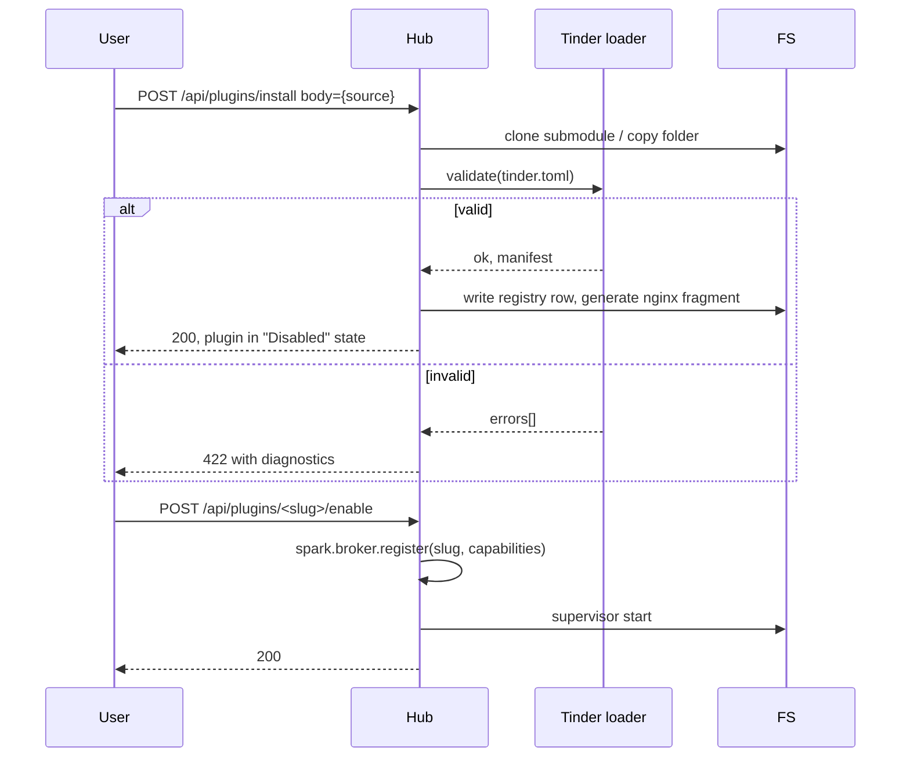

# Plugin contract — Tinder manifest

**Authority:** This document defines the on-disk contract every Hearth plugin must satisfy. The hub's Tinder loader (`apps/hub/api/tinder/`) implements it. When code disagrees with this doc, fix the code (or amend per [`docs/ai-context.md`](../ai-context.md)).

**Examples:** Manifest samples below use `groceries` / `pantry-glance` as **illustrative slugs only**. The Hearth repo does not ship those plugins; real plugins live in separate repositories (see [`architecture/overview.md`](architecture/overview.md#1b-plugin-agnosticism-hub-boundary)).

A plugin is **discoverable** when a `tinder.toml` file exists at the plugin's root and parses against the schema below. A plugin is **installable** when discovery succeeds and required permissions are acceptable to the user.

## Plugin kind: app vs widget

Every plugin declares a **kind** that determines how Hearth surfaces it. See [`dashboard.md`](dashboard.md) for the home grid and phasing.

| Kind | Default | Full UI at `/<slug>/` | Dashboard grid | `entrypoint.ui` |
|------|---------|------------------------|----------------|-----------------|
| **`app`** | yes | **Required** when enabled | Optional `app-shortcut` block | **Required** (`static`, `iframe-spa`, …) |
| **`widget`** | — | **No** | **Widget** block(s) via hub-rendered snapshot | **Must be absent** |

```toml
[plugin]
kind = "app"   # omitted ⇒ "app"
```

**MVP:** only **`app`** plugins may be **enabled**. The loader accepts `kind = "widget"` at install time; `enable` returns **501** until widget hosting is implemented ([`dashboard.md`](dashboard.md#mvp-policy)).

### Widget-only manifest (future)

```toml
[plugin]
slug    = "pantry-glance"
name    = "Pantry glance"
kind    = "widget"
version = "0.1.0"
hearth_min = "0.1.0"

[entrypoint]
backend = { kind = "python", module = "pantry_glance.app:create_app", port_env = "HEARTH_PLUGIN_PORT" }
# no [entrypoint.ui] — widgets do not ship a full SPA

[widget.surfaces.item-count]
title = "Pantry"
span_default = { w = 2, h = 1 }   # suggested size when user adds block

[capabilities.widget]
methods = ["snapshot"]              # hub calls via Spark; exact names in spark-api when scheduled
events  = ["changed"]
```

Widget surfaces are named keys under `[widget.surfaces.<id>]`. The dashboard block references `plugin` + `surface`.

## File: `tinder.toml`

```toml
# === required ===
[plugin]
slug         = "groceries"            # kebab-case, ≤ 32 chars, ASCII, unique
name         = "Groceries"            # human-readable
version      = "0.1.0"                # semver
hearth_min   = "0.1.0"                # min hub API version
kind         = "app"                  # "app" | "widget" — default "app"
description  = "Pantry, shopping list, store-aware sorting."
icon         = "icon.svg"             # path relative to plugin root, optional

[entrypoint]
backend  = { kind = "python", module = "groceries.app:create_app", port_env = "HEARTH_PLUGIN_PORT" }
# alternatives:
#   backend = { kind = "node",   command = ["node", "server.js"], port_env = "HEARTH_PLUGIN_PORT" }
#   backend = { kind = "binary", command = ["./bin/groceries"],   port_env = "HEARTH_PLUGIN_PORT" }
ui       = { kind = "static", path = "web/dist" }   # required for kind=app; forbidden for kind=widget
# alternatives:
#   ui = { kind = "iframe-spa", base = "/" }                 # plugin serves its own SPA
#   ui = { kind = "module-federation", remote = "/remoteEntry.js" }   # post-MVP

# === optional but common ===
[capabilities.list]                    # one block per capability surface
methods = ["add", "remove", "items"]   # callable via spark.call("groceries", "list.add", …)
events  = ["added", "removed"]         # publishable via spark.publish("groceries.list.added", …)

[capabilities.pantry]
methods = ["set", "items"]
events  = ["changed"]

[permissions]
spark_call    = ["recipes.*", "pantry.*"]   # who this plugin may CALL
spark_publish = ["groceries.*"]             # what topics it may publish (its own ns by default)
spark_subscribe = ["pantry.changed", "recipes.cooked"]
fs_paths      = ["plugins/groceries"]       # always confined; declared for clarity
network       = "loopback"                  # one of: none | loopback | lan | internet

[backup]
include = ["plugins/groceries/db.sqlite"]
exclude = ["plugins/groceries/cache/"]

[ui.nav]
label = "Groceries"
icon  = "shopping-cart"        # lucide icon name, falls back to plugin.icon
order = 30                     # ordering hint in the Mantle nav
show_in_tab_bar = true         # optional; default true for kind=app

[ui.chrome]                    # optional; app plugins only — extend shell bars (see mantle-ui.md)
top    = { slots = ["actions"] }    # registers plugin content in named top-bar slots
bottom = { slots = ["primary"] }
```

## Validation rules

| Rule | Effect on failure |
|------|--------------------|
| `plugin.kind` ∈ {`app`, `widget`} | reject install |
| `kind=app` ⇒ `entrypoint.ui` present and valid | reject install |
| `kind=widget` ⇒ `entrypoint.ui` absent; at least one `[widget.surfaces.*]` | reject install |
| `plugin.slug` matches `^[a-z][a-z0-9-]{0,31}$` and is unique | reject install |
| `plugin.version` is semver | reject install |
| `entrypoint.backend.kind` ∈ {`python`, `node`, `binary`, `none`} | reject install |
| `entrypoint.ui.kind` ∈ {`static`, `iframe-spa`, `module-federation`} | reject install |
| Topics in `permissions.spark_*` use namespaces the plugin owns or wildcards within them | warn + restrict at runtime |
| `permissions.network` requested but unsupported in current deploy mode | install but disable plugin, surface error |
| Referenced files (`icon`, `entrypoint.ui.path`) exist at install time | warn (plugin still loads with placeholder) |
| Paths in `[backup].include` and `[backup].exclude` stay inside the plugin's declared data root | reject install for escaped include; warn + ignore escaped exclude |

## Backup metadata

The `[backup]` block is a declaration of durable local plugin data. It does **not** make the hub responsible for reading plugin internals during MVP; it gives future backup tooling a stable boundary.

Plugins that own durable data should:

| Rule | Requirement |
|------|-------------|
| Local data root | Keep durable state under `var/hearth/plugins/<slug>/` unless the manifest grants a narrower explicit path. |
| Include list | Declare files or directories required for restore in `[backup].include`. |
| Exclude list | Exclude caches, temporary files, generated build output, downloads, and other disposable data in `[backup].exclude`. |
| Snapshot safety | Flush or checkpoint data stores before shutdown; future backup hooks may ask plugins to produce a quiescent snapshot. |
| Secrets | Keep long-lived secrets out of plugin backup paths. Cloud backup should handle only encrypted artifacts. |

Later-phase backup design lives in [`native-plugin-ideas.md`](native-plugin-ideas.md) and [`plugin-ideas/system-backup.md`](plugin-ideas/system-backup.md).

## Lifecycle hooks (optional)

A plugin may implement these endpoints on its backend. Hub calls them via Spark, never HTTP:

| Method | When | Body | Expected response |
|--------|------|------|-------------------|
| `lifecycle.preflight` | After validation, before first start | `{hearth_version, plugin_dir}` | `{ok: true}` or `{ok: false, error}` |
| `lifecycle.ready`     | Plugin sends to hub once HTTP server is bound | `{port, capabilities}` | hub responds `{ok: true}` and starts proxying |
| `lifecycle.shutdown`  | Hub calls before SIGTERM | `{}` | best-effort `{ok: true}` |
| `health`              | Periodic | `{}` | `{ok: bool, detail?: str}` |

Plugins missing a hook simply skip it; the registry records which hooks each plugin supports.

## Discovery sources

In priority order:

1. **Submodule plugins** — directories under `apps/<slug>/` that contain `tinder.toml`. Discovered on hub startup and on `kindling install`.
2. **Drop-in directory** — `var/hearth/plugins.d/<slug>/` (symlink or copy). For users who don't want to use git submodules.
3. **Future:** OCI image registry (Phase 2+). Out of scope for FR-0001.

## Installation flow



## Versioning

- The hub publishes `hearth.api_version` (semver). A plugin's `plugin.hearth_min` must be `<=` it.
- Tinder schema itself is versioned by a top-level `tinder = "1"` (assumed `"1"` if absent for MVP).

## Examples

A reference plugin lives in **Kindling** at `templates/plugin-python/tinder.toml` and is what `kindling new <slug>` copies. See [`docs/design/satellite-repos/kindling.md`](satellite-repos/kindling.md).
