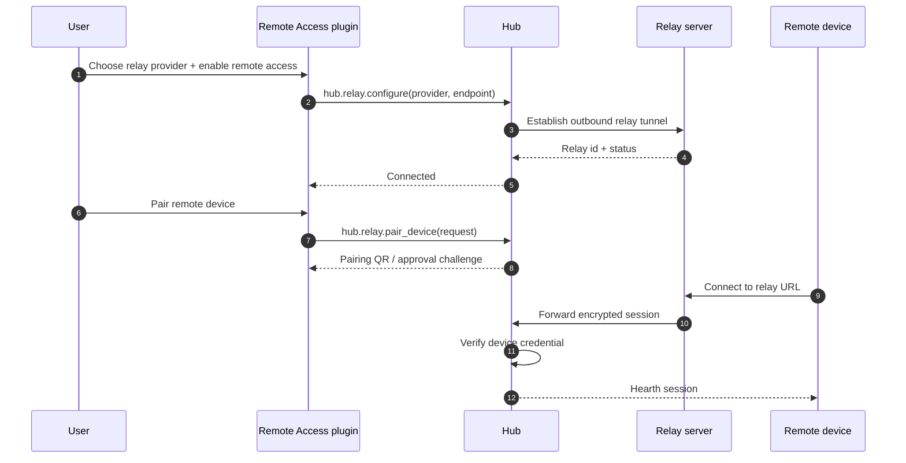

# Native plugin idea — remote access

**Status:** later-phase idea, depends on Ember relay functionality.  
**Proposed slug:** `remote-access`.  
**Mount point:** `apps/remote-access/` as a git submodule when implemented.

## Charter

Create a native Hearth plugin that lets authorized remote users access a local Hearth setup through a relay. The plugin owns the user-facing remote access experience: pairing devices, showing relay status, managing allowed users/devices, exposing connection diagnostics, and coordinating with the hub's relay connector once the Ember relay server and protocol are available.

## Why this belongs as a plugin

Remote access is a category where multiple implementations should be able to compete: hosted Ember relay, self-hosted Ember on a VPS, a Tailscale-style adapter, or another community relay. Hearth should keep the smallest durable platform contract for identity, routing, and local trust while letting plugins provide the product experience and provider-specific integrations.

This follows the plugin-first ecosystem principle: anything that can live behind the plugin interface should live there, so open-source contributors can build upgrades, alternatives, and competing implementations without forking the hub.

The relay server itself remains separate infrastructure. This plugin depends on that relay capability being present; it should not invent port-forwarding or bypass Hearth's identity model.

## Tinder sketch

```toml
[plugin]
slug = "remote-access"
name = "Remote Access"
version = "0.1.0"
hearth_min = "0.1.0"
description = "Manage secure remote access to this Hearth box through a relay."

[entrypoint]
backend = { kind = "python", module = "remote_access.app:create_app", port_env = "HEARTH_PLUGIN_PORT" }
ui = { kind = "static", path = "web/dist" }

[capabilities.remote_access]
methods = ["configure", "pair_device", "revoke_device", "status", "diagnostics"]
events = ["connected", "disconnected", "device_paired", "device_revoked"]

[permissions]
spark_call = ["hub.identity.*", "hub.relay.*", "hub.settings.*"]
spark_publish = ["remote-access.*"]
spark_subscribe = ["hub.relay.connected", "hub.relay.disconnected", "hub.identity.device_revoked"]
fs_paths = ["plugins/remote-access"]
network = "internet"

[backup]
include = ["plugins/remote-access/state.sqlite"]
exclude = ["plugins/remote-access/cache/"]

[ui.nav]
label = "Remote"
icon = "radio-tower"
order = 70
```

## Platform dependency

This plugin requires a platform-level relay surface. The hub or Ember connector must provide:

| Surface | Responsibility |
|---------|----------------|
| `hub.relay.configure` | Register relay endpoint, hosted/self-hosted mode, and tunnel settings. |
| `hub.relay.status` | Report tunnel health, current relay id, latency, and last error. |
| `hub.relay.pair_device` | Mint or approve device credentials without exposing private keys to the plugin. |
| `hub.relay.revoke_device` | Revoke device access and close active sessions. |
| `hub.identity.devices` | List locally trusted devices and their scopes. |

The plugin may call these surfaces through Spark, but private keys, tunnel sockets, and request proxying remain owned by the hub/relay connector.

## Remote access flow



## Data and backup

The plugin stores only non-secret configuration and audit state:

| Data | Backup behavior |
|------|-----------------|
| Provider choice and relay endpoint | Include in plugin backup. |
| Device display names and local labels | Include in plugin backup. |
| Diagnostics history and connection logs | Exclude or retain with a short window; logs may reveal usage patterns. |
| Device private keys, relay tokens, and signing keys | Never store in plugin backup paths; keep in hub-managed secrets or secure device storage. |

Restoring the plugin should restore preferences and labels, but device trust may need explicit re-pairing unless the hub's identity store is restored at the same time.

## Native repo/submodule plan

When this idea graduates, create a standalone plugin repository and mount it into Hearth:

```bash
# create the plugin repo separately, then inside Hearth
git submodule add <remote-access-repo-url> apps/remote-access
git submodule update --init --recursive apps/remote-access

# inside apps/remote-access
./init-skeleton
kindling new remote-access
```

The plugin repo should carry its own `.skeleton` workflow, feature-history, tickets, threat model notes, and provider adapter docs. Hearth should track only the submodule pointer and any hub relay/identity contract changes needed to support it.

## Open questions

- Which relay providers are first-class: hosted Ember, self-hosted Ember, or both?
- Should the plugin manage households/shared users, or only single-owner device access at first?
- What minimum hub relay contract is needed before this plugin can be built?
- Does remote access belong in one plugin, or should there be a provider-neutral "Remote Access" plugin plus provider-specific plugins?
- How should users recover if remote access is misconfigured and they are away from home?

## Non-goals

- Router port-forwarding, DDNS, or direct WAN exposure as the primary path.
- Storing private keys or relay credentials in plugin-owned backup paths.
- Letting plugins terminate or inspect remote application plaintext.
- Replacing the Ember relay server implementation.
- Multi-tenant relay cluster operations, billing, or abuse handling inside the Hearth plugin.
