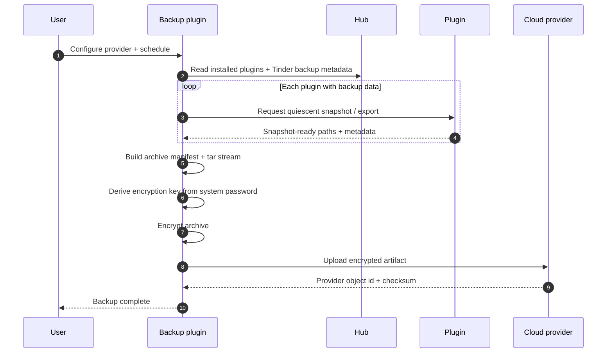

# Native plugin idea — system backup

**Status:** later-phase idea, not MVP scope.  
**Proposed slug:** `system-backup` or `hearth-backup`.  
**Mount point:** `apps/system-backup/` as a git submodule when implemented.

## Charter

Create a native Hearth plugin that performs full system backup for the hub and installed plugins. Plugins declare what durable local data they own, Hearth exposes the installed-plugin registry and backup metadata, and the backup plugin snapshots that data, encrypts it with a key derived from the system password, then uploads the encrypted artifact to a configured cloud provider for safekeeping.

## Why this belongs as a plugin

Backup is user-facing, provider-specific, and likely to evolve faster than the hub. Keeping it as a native plugin lets Hearth keep the core contract small while still giving backup a first-class UI, Spark capabilities, lifecycle scheduling, provider adapters, and restore workflows.

The hub should provide only the platform surfaces that every backup implementation needs: plugin registry access, declared backup paths, lifecycle coordination, local identity, and secret storage. Provider logic belongs in the plugin.

## Tinder sketch

```toml
[plugin]
slug = "system-backup"
name = "System Backup"
version = "0.1.0"
hearth_min = "0.1.0"
description = "Encrypted cloud backup and restore for Hearth."

[entrypoint]
backend = { kind = "python", module = "system_backup.app:create_app", port_env = "HEARTH_PLUGIN_PORT" }
ui = { kind = "static", path = "web/dist" }

[capabilities.backup]
methods = ["configure", "run", "status", "restore_plan"]
events = ["started", "completed", "failed"]

[permissions]
spark_call = ["hub.plugins.*", "hub.backup.*"]
spark_publish = ["system-backup.*"]
spark_subscribe = ["hub.plugin.installed", "hub.plugin.removed"]
fs_paths = ["plugins/system-backup"]
network = "internet"

[backup]
include = ["plugins/system-backup/state.sqlite"]
exclude = ["plugins/system-backup/cache/"]

[ui.nav]
label = "Backups"
icon = "cloud-upload"
order = 80
```

## Persistence rules for plugins

To be safely backed up, every plugin that owns durable data should follow these rules:

| Rule | Requirement |
|------|-------------|
| Local data root | Store durable data under `var/hearth/plugins/<slug>/` unless the Tinder contract grants a narrower explicit path. |
| Manifest declaration | Declare durable files in the `tinder.toml` `[backup]` block with `include` and `exclude` paths. |
| Cache separation | Keep caches, build output, temporary files, and downloaded artifacts in paths that can be excluded. |
| Quiescent snapshot | Provide a lifecycle hook or Spark method that can flush writes before snapshot when the data store needs it. SQLite plugins should checkpoint WAL files or expose an export path. |
| Restore validation | Document schema version and migration expectations so a restored data directory can be checked before the plugin is re-enabled. |
| Secrets | Do not store cloud tokens, passwords, or long-lived credentials in plugin backup paths. Use the hub's secrets area or a future secret capability; cloud backups should exclude raw secrets. |

These rules extend the existing Tinder backup metadata in [`../plugin-contract.md`](../plugin-contract.md). They should become an authoritative contract only when this idea graduates into an `FR-NNNN`.

## Backup flow



## Encryption model

The plugin should never store the system password. At backup time, derive an encryption key from the user-supplied system password using a memory-hard KDF such as Argon2id with a per-backup random salt. Store only non-secret metadata with the encrypted artifact: salt, KDF parameters, creation time, Hearth version, plugin manifest versions, archive checksum, and provider object id.

Restore requires the same system password. If the password changes, the system needs an explicit re-key flow rather than silently weakening backup encryption.

## Cloud provider adapters

Initial providers to evaluate:

| Provider | Notes |
|----------|-------|
| S3-compatible storage | Simple object model, good for self-hosted MinIO or paid storage. |
| Google Drive | Familiar consumer option; OAuth and token refresh need careful secret handling. |
| iCloud Drive | Useful for Apple-first households, but automation behavior may be less predictable. |

Provider adapters should upload encrypted blobs only. The provider should never receive raw plugin data, decrypted manifests, or the system password.

## Native repo/submodule plan

When this idea graduates, create a standalone plugin repository and mount it into Hearth:

```bash
# create the plugin repo separately, then inside Hearth
git submodule add <system-backup-repo-url> apps/system-backup
git submodule update --init --recursive apps/system-backup

# inside apps/system-backup
./init-skeleton
kindling new system-backup
```

The plugin repo should carry its own `.skeleton` workflow, feature-history, and tickets. Hearth should only track the submodule pointer and the platform contract changes needed to support backup lifecycle methods.

## Restore flow

Restore should be deliberate and staged:

1. Download encrypted artifact.
2. Prompt for the system password and decrypt locally.
3. Validate archive manifest, checksums, Hearth version, plugin slugs, and plugin schema versions.
4. Restore hub registry and plugin data into a staging path.
5. Re-enable plugins only after their restore validation passes.

## Open questions

- Should backup scheduling live entirely in the plugin, or should Hearth expose a generic scheduled-job capability?
- What lifecycle hook names should become part of Tinder: `backup.prepare`, `backup.snapshot`, `backup.restore_validate`, `backup.restore_apply`, or a smaller surface?
- How does this interact with Ember's Phase-2 remote access and backup provider work?
- Do we need incremental backups, or is full encrypted archive backup enough for the first version?
- What is the recovery path if the user forgets the system password?

## Non-goals for the first version

- Cross-device merge or conflict resolution.
- Backing up raw secrets to cloud storage.
- Provider-side encryption as the only protection.
- Marketplace distribution or paid backup plans.
- A generic filesystem backup for arbitrary host paths outside Hearth's data roots.
