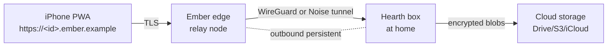

# Ember — relay (Phase 2 sketch)

**Status:** sketch. Not part of FR-0001. Will be allocated a separate `FR-NNNN` when MVP is on the air. This document is a **direction-of-travel** anchor — do not implement against it without first promoting the relevant section to a real design under `docs/design/relay/` and going through `/feature-request`.

## What it is

A small cloud-hosted relay that lets a user reach their Hearth box from anywhere on the open internet, with **end-to-end encryption between the iPhone PWA and the Hearth box**. Ember does not see plaintext.

The relay server is infrastructure. The Hearth-side product experience may live in a native [`remote-access`](../plugin-ideas/remote-access.md) plugin once the hub exposes the relay and identity surfaces that plugin needs.

## Why a relay (not port-forwarding)

- Many home networks are behind CGNAT or have a non-static IP.
- Asking users to configure routers, DDNS, and WAN firewalls is the dominant reason "self-host" projects don't get used.
- Outbound connections are reliable everywhere; we lean on that instead.

## Target topology

- The hub keeps an outbound persistent connection to Ember (Noise IK or WireGuard).
- The phone connects to `https://<id>.ember.example/` over TLS. Ember terminates TLS only at the relay-control plane (account, billing, routing decisions). Application traffic from the phone is **doubly encrypted**: the outer TLS to Ember, and an inner ChaCha20-Poly1305 envelope keyed by a hub-issued device key. Ember sees ciphertext from end to end.

## Identity

- Each Hearth box generates a long-lived Ed25519 keypair at install. Public key is registered with Ember.
- Each user device (iPhone, laptop) is paired by scanning a QR on the dashboard; the hub mints a device cert signed by its key. Device cert + private key are stored in the iOS keychain via the PWA's WebAuthn / WebCrypto flow.
- Ember authenticates the relay tunnel; the hub authenticates the device.

## Data store options (encrypted backup)

Ember offers configurable cloud-storage adapters, all storing **client-side encrypted** blobs:

| Adapter | Notes |
|---------|-------|
| Google Drive | OAuth, app-scoped folder; large quota |
| S3-compatible | Backblaze B2, Cloudflare R2, MinIO; cheapest |
| iCloud Drive (best-effort) | iCloud Drive does not expose an open API; reachable only via on-Mac launch agent — flag as best-effort for Mac mini hosts only |
| Local NAS over WebDAV | For users who already have one |

Encryption: per-blob random key, key wrapped under a per-user master derived from a passphrase + device key. Master key never leaves the box; only wrapped blobs reach the cloud.

## Notification routing

Web Push works through Ember unchanged for off-LAN devices: the hub still signs VAPID; outbound goes either directly to push providers (when the hub has internet, which Ember requires) or through Ember if outbound rules block direct.

## Out-of-scope (sketch level)

- **Mining / token economics.** The original brief floated Ember nodes acting as miners in a "home-server compute / data" cryptocurrency. Tracked in `roadmap.md` Phase 4 as a research item; needs a feasibility + legal study before any design work. **Do not assume.**
- **Multi-tenant relay clusters.** MVP-Ember is a single relay that routes by `<id>`; clustering is a later concern.
- **Federation between two users' Hearth boxes.** A reasonable next step but separate from "remote access for my own devices."

## Ticket plan (preview, do not implement until Ember FR is allocated)

- **`T-FR-???-01`** Ember protocol spec (Noise IK over TLS) + reference implementation.
- **`T-FR-???-02`** Hub side: outbound tunnel, device pairing UX, key management.
- **`T-FR-???-03`** Ember edge: account, billing, routing, abuse limits.
- **`T-FR-???-04`** Encrypted backup adapters: Drive + S3 first, others optional.
- **`T-FR-???-05`** Restore-from-backup flow on a fresh Hearth install.
- **`T-FR-???-06`** Audit + threat model review.

## Open questions

| ID | Question |
|----|----------|
| E1 | Self-hostable Ember? Yes — must be. The open-source Ember binary should be runnable on a $5/mo VPS by any user who doesn't want to use the hosted relay. |
| E2 | Group identity / household sharing — out of scope for first Ember FR? Yes; revisit after single-user remote works. |
| E3 | Mobile background sync — service worker + PushSync? Investigate; might be enough for "fresh dashboard on launch" without real native code. |
