# Tickets — index and global DAG

**Canonical definitions:** Implementation tickets (**`### T-FR-NNNN-xx`**, phases, **Deps:**) live under **`tasks/feature-history/FR-NNNN-<slug>/tickets.md`** — one file per feature line. See **`tasks/feature-history/TICKET-SOURCES.md`** and **`docs/design/documentation-style.md`**.

**This doc (`docs/design/tickets-initial.md`):** registry of **where** tickets live + **global** mermaid (cross-feature when needed) + **`triadDone`** styling for the published DAG. Do **not** duplicate full ticket bodies here; edit the per-feature **`tickets.md`** instead.

**Queue / progress:** **`tasks/ticket-progress.md`**.

**Deps:** `none` means no ticket dependency. A ticket is **eligible** when all **Deps** are **VAL** = `done` in **`ticket-progress.md`**.

**Mermaid triad nodes:** For **`T-FR-NNNN-xx`**, node ids are **`TFR` + `NNNN` + `_` + `xx` + `_` + `TEST|DEV|VAL`**. When a ticket is fully complete, add the corresponding `class … triadDone` line below (union when merging parallel work).

---

## Per-feature ticket files (canonical)

| FR id | Path (repo root) |
|-------|------------------|
| FR-0000 | `tasks/feature-history/FR-0000-bootstrap/tickets.md` |
| FR-0001 | `tasks/feature-history/FR-0001-hearth-platform/tickets.md` *(parked pending FR-0002)* |
| FR-0002 | `tasks/feature-history/FR-0002-iphone-pwa-prototype/tickets.md` |
| FR-0003 | `tasks/feature-history/FR-0003-hearth-pi-docker-cli/tickets.md` |
| FR-0004 | `tasks/feature-history/FR-0004-centralized-users-auth/tickets.md` *(in progress: built-in auth provider)* |
| FR-0005 | `tasks/feature-history/FR-0005-remote-build-pi-deploy/tickets.md` *(design: Mac build → Pi `192.168.1.62`)* |
| FR-0006 | `tasks/feature-history/FR-0006-design-language/tickets.md` *(design-language; in flight on `feat/FR-0006-design-language`)* |

---

## DAG Overview (global)

Extend this diagram when new **`FR-NNNN`** lines add tickets that chain to existing work.

```mermaid
graph LR
  %% FR-0000 — bootstrap
  TFR0000_01_TEST --> TFR0000_01_DEV --> TFR0000_01_VAL

  %% FR-0002 — iPhone PWA prototype (active; parks FR-0001)
  TFR0002_01_TEST --> TFR0002_01_DEV --> TFR0002_01_VAL
  TFR0002_02_TEST --> TFR0002_02_DEV --> TFR0002_02_VAL
  TFR0002_03_TEST --> TFR0002_03_DEV --> TFR0002_03_VAL
  TFR0002_04_TEST --> TFR0002_04_DEV --> TFR0002_04_VAL
  TFR0002_01_VAL --> TFR0002_03_TEST
  TFR0002_02_VAL --> TFR0002_03_TEST
  TFR0002_03_VAL --> TFR0002_04_TEST

  %% FR-0001 reuse hooks (parked; FR-0002 outputs feed these)
  TFR0002_01_VAL -.reuse.-> TFR0001_05_TEST
  TFR0002_02_VAL -.reuse.-> TFR0001_04_TEST
  TFR0002_03_VAL -.reuse.-> TFR0001_09_TEST

  %% FR-0001 — Hearth platform
  TFR0001_01_TEST --> TFR0001_01_DEV --> TFR0001_01_VAL
  TFR0001_02_TEST --> TFR0001_02_DEV --> TFR0001_02_VAL
  TFR0001_03_TEST --> TFR0001_03_DEV --> TFR0001_03_VAL
  TFR0001_04_TEST --> TFR0001_04_DEV --> TFR0001_04_VAL
  TFR0001_05_TEST --> TFR0001_05_DEV --> TFR0001_05_VAL
  TFR0001_06_TEST --> TFR0001_06_DEV --> TFR0001_06_VAL
  TFR0001_07_TEST --> TFR0001_07_DEV --> TFR0001_07_VAL
  TFR0001_08_TEST --> TFR0001_08_DEV --> TFR0001_08_VAL
  TFR0001_09_TEST --> TFR0001_09_DEV --> TFR0001_09_VAL
  TFR0001_10_TEST --> TFR0001_10_DEV --> TFR0001_10_VAL

  %% inter-ticket deps (Hearth platform)
  TFR0001_01_VAL --> TFR0001_02_TEST
  TFR0001_01_VAL --> TFR0001_04_TEST
  TFR0001_01_VAL --> TFR0001_05_TEST
  TFR0001_02_VAL --> TFR0001_03_TEST
  TFR0001_02_VAL --> TFR0001_06_TEST
  TFR0001_03_VAL --> TFR0001_05_TEST
  TFR0001_04_VAL --> TFR0001_05_TEST
  TFR0001_03_VAL --> TFR0001_07_TEST
  TFR0001_04_VAL --> TFR0001_07_TEST
  TFR0001_06_VAL --> TFR0001_07_TEST
  TFR0001_07_VAL --> TFR0001_08_TEST
  TFR0001_02_VAL --> TFR0001_09_TEST
  TFR0001_04_VAL --> TFR0001_09_TEST
  TFR0001_05_VAL --> TFR0001_10_TEST
  TFR0001_08_VAL --> TFR0001_10_TEST
  TFR0001_09_VAL --> TFR0001_10_TEST

  %% FR-0003 — Pi Docker CLI + hearth/plugin tooling
  TFR0003_01_TEST --> TFR0003_01_DEV --> TFR0003_01_VAL
  TFR0003_02_TEST --> TFR0003_02_DEV --> TFR0003_02_VAL
  TFR0003_03_TEST --> TFR0003_03_DEV --> TFR0003_03_VAL
  TFR0003_04_TEST --> TFR0003_04_DEV --> TFR0003_04_VAL
  TFR0003_05_TEST --> TFR0003_05_DEV --> TFR0003_05_VAL
  TFR0003_06_TEST --> TFR0003_06_DEV --> TFR0003_06_VAL
  TFR0003_07_TEST --> TFR0003_07_DEV --> TFR0003_07_VAL
  TFR0003_08_TEST --> TFR0003_08_DEV --> TFR0003_08_VAL
  TFR0003_09_TEST --> TFR0003_09_DEV --> TFR0003_09_VAL
  TFR0003_10_TEST --> TFR0003_10_DEV --> TFR0003_10_VAL
  TFR0003_11_TEST --> TFR0003_11_DEV --> TFR0003_11_VAL
  TFR0003_12_TEST --> TFR0003_12_DEV --> TFR0003_12_VAL
  TFR0003_13_TEST --> TFR0003_13_DEV --> TFR0003_13_VAL

  TFR0003_01_VAL --> TFR0003_02_TEST
  TFR0003_01_VAL --> TFR0003_13_TEST
  TFR0003_02_VAL --> TFR0003_04_TEST
  TFR0003_02_VAL --> TFR0003_05_TEST
  TFR0003_02_VAL --> TFR0003_10_TEST
  TFR0003_05_VAL --> TFR0003_03_TEST
  TFR0003_04_VAL --> TFR0003_06_TEST
  TFR0003_05_VAL --> TFR0003_06_TEST
  TFR0003_04_VAL --> TFR0003_07_TEST
  TFR0003_05_VAL --> TFR0003_07_TEST
  TFR0003_04_VAL --> TFR0003_09_TEST
  TFR0003_05_VAL --> TFR0003_09_TEST
  TFR0003_07_VAL --> TFR0003_08_TEST
  TFR0003_07_VAL --> TFR0003_11_TEST
  TFR0003_10_VAL --> TFR0003_11_TEST
  TFR0003_03_VAL --> TFR0003_12_TEST
  TFR0003_06_VAL --> TFR0003_12_TEST
  TFR0003_08_VAL --> TFR0003_12_TEST
  TFR0003_09_VAL --> TFR0003_12_TEST
  TFR0003_11_VAL --> TFR0003_12_TEST

  %% FR-0004 — centralized users auth
  TFR0004_01_TEST --> TFR0004_01_DEV --> TFR0004_01_VAL
  TFR0004_02_TEST --> TFR0004_02_DEV --> TFR0004_02_VAL
  TFR0004_03_TEST --> TFR0004_03_DEV --> TFR0004_03_VAL
  TFR0004_04_TEST --> TFR0004_04_DEV --> TFR0004_04_VAL
  TFR0004_05_TEST --> TFR0004_05_DEV --> TFR0004_05_VAL
  TFR0004_06_TEST --> TFR0004_06_DEV --> TFR0004_06_VAL
  TFR0004_07_TEST --> TFR0004_07_DEV --> TFR0004_07_VAL
  TFR0004_08_TEST --> TFR0004_08_DEV --> TFR0004_08_VAL
  TFR0004_09_TEST --> TFR0004_09_DEV --> TFR0004_09_VAL
  TFR0004_10_TEST --> TFR0004_10_DEV --> TFR0004_10_VAL
  TFR0004_11_TEST --> TFR0004_11_DEV --> TFR0004_11_VAL
  TFR0004_12_TEST --> TFR0004_12_DEV --> TFR0004_12_VAL
  TFR0004_13_TEST --> TFR0004_13_DEV --> TFR0004_13_VAL
  TFR0004_14_TEST --> TFR0004_14_DEV --> TFR0004_14_VAL
  TFR0004_15_TEST --> TFR0004_15_DEV --> TFR0004_15_VAL
  TFR0004_16_TEST --> TFR0004_16_DEV --> TFR0004_16_VAL
  TFR0004_01_VAL --> TFR0004_02_TEST
  TFR0004_02_VAL --> TFR0004_03_TEST
  TFR0004_03_VAL --> TFR0004_04_TEST
  TFR0004_03_VAL --> TFR0004_06_TEST
  TFR0004_04_VAL --> TFR0004_05_TEST
  TFR0004_04_VAL --> TFR0004_07_TEST
  TFR0004_04_VAL --> TFR0004_09_TEST
  TFR0004_05_VAL --> TFR0004_08_TEST
  TFR0004_03_VAL --> TFR0004_08_TEST
  TFR0004_05_VAL --> TFR0004_10_TEST
  TFR0004_07_VAL --> TFR0004_10_TEST
  TFR0004_08_VAL --> TFR0004_10_TEST
  TFR0004_10_VAL --> TFR0004_11_TEST
  TFR0004_11_VAL --> TFR0004_12_TEST
  TFR0004_12_VAL --> TFR0004_13_TEST
  TFR0004_12_VAL --> TFR0004_14_TEST
  TFR0004_12_VAL --> TFR0004_15_TEST
  TFR0004_14_VAL --> TFR0004_15_TEST
  TFR0004_13_VAL --> TFR0004_16_TEST
  TFR0004_14_VAL --> TFR0004_16_TEST
  TFR0004_15_VAL --> TFR0004_16_TEST

  %% FR-0005 — remote build Mac → Pi deploy
  TFR0005_01_TEST --> TFR0005_01_DEV --> TFR0005_01_VAL
  TFR0005_02_TEST --> TFR0005_02_DEV --> TFR0005_02_VAL
  TFR0005_03_TEST --> TFR0005_03_DEV --> TFR0005_03_VAL
  TFR0005_04_TEST --> TFR0005_04_DEV --> TFR0005_04_VAL
  TFR0005_05_TEST --> TFR0005_05_DEV --> TFR0005_05_VAL
  TFR0005_01_VAL --> TFR0005_02_TEST
  TFR0005_01_VAL --> TFR0005_03_TEST
  TFR0005_02_VAL --> TFR0005_04_TEST
  TFR0005_02_VAL --> TFR0005_05_TEST

  %% FR-0006 — design-language unification (feat/FR-0006-design-language)
  TFR0006_01_TEST --> TFR0006_01_DEV --> TFR0006_01_VAL
  TFR0006_02_TEST --> TFR0006_02_DEV --> TFR0006_02_VAL
  TFR0006_03_TEST --> TFR0006_03_DEV --> TFR0006_03_VAL
  TFR0006_04_TEST --> TFR0006_04_DEV --> TFR0006_04_VAL
  TFR0006_05_TEST --> TFR0006_05_DEV --> TFR0006_05_VAL
  TFR0006_06_TEST --> TFR0006_06_DEV --> TFR0006_06_VAL
  TFR0006_07_TEST --> TFR0006_07_DEV --> TFR0006_07_VAL
  TFR0006_08_TEST --> TFR0006_08_DEV --> TFR0006_08_VAL
  TFR0006_09_TEST --> TFR0006_09_DEV --> TFR0006_09_VAL
  TFR0006_10_TEST --> TFR0006_10_DEV --> TFR0006_10_VAL
  TFR0006_11_TEST --> TFR0006_11_DEV --> TFR0006_11_VAL
  TFR0006_12_TEST --> TFR0006_12_DEV --> TFR0006_12_VAL
  TFR0006_13_TEST --> TFR0006_13_DEV --> TFR0006_13_VAL
  TFR0006_14_TEST --> TFR0006_14_DEV --> TFR0006_14_VAL
  TFR0006_15_TEST --> TFR0006_15_DEV --> TFR0006_15_VAL
  TFR0006_01_VAL --> TFR0006_04_TEST
  TFR0006_02_VAL --> TFR0006_07_TEST
  TFR0006_02_VAL --> TFR0006_09_TEST
  TFR0006_03_VAL --> TFR0006_04_TEST
  TFR0006_03_VAL --> TFR0006_05_TEST
  TFR0006_03_VAL --> TFR0006_06_TEST
  TFR0006_03_VAL --> TFR0006_12_TEST
  TFR0006_03_VAL --> TFR0006_14_TEST
  TFR0006_07_VAL --> TFR0006_08_TEST
  TFR0006_07_VAL --> TFR0006_09_TEST
  TFR0006_10_VAL --> TFR0006_11_TEST
  TFR0006_10_VAL --> TFR0006_12_TEST
  TFR0006_10_VAL --> TFR0006_13_TEST
  TFR0006_10_VAL --> TFR0006_14_TEST
  TFR0006_12_VAL --> TFR0006_13_TEST
  TFR0006_11_VAL --> TFR0006_15_TEST
  TFR0006_12_VAL --> TFR0006_15_TEST
  TFR0006_13_VAL --> TFR0006_15_TEST
  TFR0006_14_VAL --> TFR0006_15_TEST

  class TFR0000_01_TEST,TFR0000_01_DEV,TFR0000_01_VAL triadDone
  class TFR0002_01_TEST,TFR0002_01_DEV,TFR0002_01_VAL triadDone
  class TFR0002_02_TEST,TFR0002_02_DEV,TFR0002_02_VAL triadDone
  class TFR0002_03_TEST,TFR0002_03_DEV,TFR0002_03_VAL triadDone
  class TFR0002_04_TEST,TFR0002_04_DEV,TFR0002_04_VAL triadDone
  class TFR0003_01_TEST,TFR0003_01_DEV,TFR0003_01_VAL triadDone
  class TFR0003_02_TEST,TFR0003_02_DEV,TFR0003_02_VAL triadDone
  class TFR0003_03_TEST,TFR0003_03_DEV,TFR0003_03_VAL triadDone
  class TFR0003_04_TEST,TFR0003_04_DEV,TFR0003_04_VAL triadDone
  class TFR0003_05_TEST,TFR0003_05_DEV,TFR0003_05_VAL triadDone
  class TFR0003_06_TEST,TFR0003_06_DEV,TFR0003_06_VAL triadDone
  class TFR0003_07_TEST,TFR0003_07_DEV,TFR0003_07_VAL triadDone
  class TFR0003_08_TEST,TFR0003_08_DEV,TFR0003_08_VAL triadDone
  class TFR0003_09_TEST,TFR0003_09_DEV,TFR0003_09_VAL triadDone
  class TFR0003_10_TEST,TFR0003_10_DEV,TFR0003_10_VAL triadDone
  class TFR0003_11_TEST,TFR0003_11_DEV,TFR0003_11_VAL triadDone
  class TFR0003_12_TEST,TFR0003_12_DEV,TFR0003_12_VAL triadDone
  class TFR0001_01_TEST,TFR0001_01_DEV,TFR0001_01_VAL triadDone
  class TFR0003_13_TEST,TFR0003_13_DEV,TFR0003_13_VAL triadDone
  class TFR0004_01_TEST,TFR0004_01_DEV,TFR0004_01_VAL triadDone
  class TFR0004_02_TEST,TFR0004_02_DEV,TFR0004_02_VAL triadDone
  class TFR0004_03_TEST,TFR0004_03_DEV,TFR0004_03_VAL triadDone
  class TFR0004_04_TEST,TFR0004_04_DEV,TFR0004_04_VAL triadDone
  class TFR0004_05_TEST,TFR0004_05_DEV,TFR0004_05_VAL triadDone
  class TFR0004_06_TEST,TFR0004_06_DEV,TFR0004_06_VAL triadDone
  class TFR0004_07_TEST,TFR0004_07_DEV,TFR0004_07_VAL triadDone
  class TFR0004_08_TEST,TFR0004_08_DEV,TFR0004_08_VAL triadDone
  class TFR0004_09_TEST,TFR0004_09_DEV,TFR0004_09_VAL triadDone
  class TFR0004_10_TEST,TFR0004_10_DEV,TFR0004_10_VAL triadDone
  class TFR0004_11_TEST,TFR0004_11_DEV,TFR0004_11_VAL triadDone
  class TFR0004_12_TEST,TFR0004_12_DEV,TFR0004_12_VAL triadDone
  class TFR0004_13_TEST,TFR0004_13_DEV,TFR0004_13_VAL triadDone
  class TFR0004_14_TEST,TFR0004_14_DEV,TFR0004_14_VAL triadDone
  class TFR0004_15_TEST,TFR0004_15_DEV,TFR0004_15_VAL triadDone

  class TFR0001_01_TEST,TFR0001_01_DEV,TFR0001_01_VAL triadDone
  class TFR0001_02_TEST,TFR0001_02_DEV,TFR0001_02_VAL triadDone
  class TFR0001_03_TEST,TFR0001_03_DEV,TFR0001_03_VAL triadDone
  class TFR0001_04_TEST,TFR0001_04_DEV,TFR0001_04_VAL triadDone
  class TFR0001_05_TEST,TFR0001_05_DEV,TFR0001_05_VAL triadDone
  class TFR0001_06_TEST,TFR0001_06_DEV,TFR0001_06_VAL triadDone
  class TFR0001_07_TEST,TFR0001_07_DEV,TFR0001_07_VAL triadDone
  class TFR0001_09_TEST,TFR0001_09_DEV,TFR0001_09_VAL triadDone
  class TFR0001_10_TEST,TFR0001_10_DEV,TFR0001_10_VAL triadDone
  class TFR0006_01_TEST,TFR0006_01_DEV,TFR0006_01_VAL triadDone
  class TFR0006_02_TEST,TFR0006_02_DEV,TFR0006_02_VAL triadDone
  class TFR0006_03_TEST,TFR0006_03_DEV,TFR0006_03_VAL triadDone
  class TFR0006_10_TEST,TFR0006_10_DEV,TFR0006_10_VAL triadDone
  class TFR0006_04_TEST,TFR0006_04_DEV,TFR0006_04_VAL triadDone
  class TFR0006_05_TEST,TFR0006_05_DEV,TFR0006_05_VAL triadDone
  class TFR0006_06_TEST,TFR0006_06_DEV,TFR0006_06_VAL triadDone
  class TFR0006_07_TEST,TFR0006_07_DEV,TFR0006_07_VAL triadDone
  class TFR0006_08_TEST,TFR0006_08_DEV,TFR0006_08_VAL triadDone
  class TFR0006_09_TEST,TFR0006_09_DEV,TFR0006_09_VAL triadDone
  class TFR0006_11_TEST,TFR0006_11_DEV,TFR0006_11_VAL triadDone
  class TFR0006_12_TEST,TFR0006_12_DEV,TFR0006_12_VAL triadDone
  class TFR0006_14_TEST,TFR0006_14_DEV,TFR0006_14_VAL triadDone
  class TFR0006_13_TEST,TFR0006_13_DEV,TFR0006_13_VAL triadDone
  class TFR0006_15_TEST,TFR0006_15_DEV,TFR0006_15_VAL triadDone

  classDef triadDone fill:#2e7d32,color:#fff
```

When ticket **`T-FR-NNNN-xx`** is fully complete (TEST/DEV/VAL all `done` in **`ticket-progress.md`**), add:

`class TFRNNNN_xx_TEST,TFRNNNN_xx_DEV,TFRNNNN_xx_VAL triadDone`

(Example for `T-FR-0000-01`: `class TFR0000_01_TEST,TFR0000_01_DEV,TFR0000_01_VAL triadDone`.)
