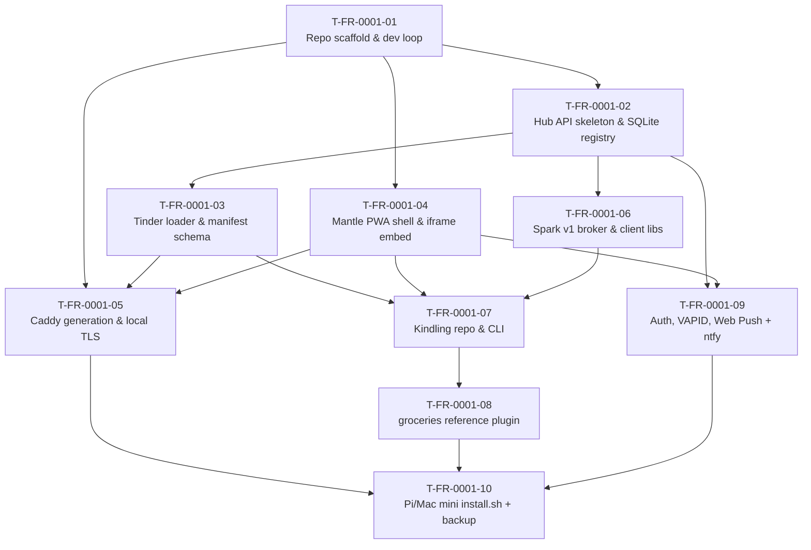

# FR-0001 — ticket DAG

Eligibility (a ticket is eligible when all `Deps:` are VAL `done`):

| When… | These become eligible in parallel |
|-------|-----------------------------------|
| `T-FR-0001-01` VAL done | `T-FR-0001-02`, `T-FR-0001-04`, `T-FR-0001-05` |
| `T-FR-0001-02` VAL done | `T-FR-0001-03`, `T-FR-0001-06` |
| `T-FR-0001-03` VAL done | `T-FR-0001-05` (already eligible from T01 too — needs both), `T-FR-0001-07` (needs T03+T04+T06) |
| `T-FR-0001-04`+`-06` VAL done (with `-03`) | `T-FR-0001-07` |
| `T-FR-0001-07` VAL done | `T-FR-0001-08` |
| `T-FR-0001-02`+`-04` VAL done | `T-FR-0001-09` |
| `T-FR-0001-05`+`-08`+`-09` VAL done | `T-FR-0001-10` (closeout) |

Frontier batches (suggested):

1. **T01** (sequential — sets the floor)
2. **T02 ‖ T04 ‖ T05-prep** (Caddy work that doesn't need T03 yet)
3. **T03 ‖ T06**
4. **T05** (finalize once T03 lands)
5. **T07 ‖ T09**
6. **T08**
7. **T10** (closeout)

Dependencies are intentionally generous. The narrowest critical path is T01 → T02 → T03 → T07 → T08 → T10.
