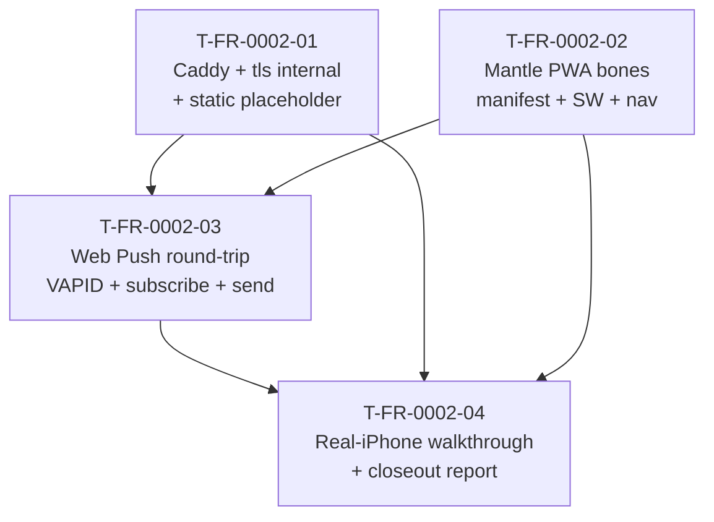

# FR-0002 — ticket DAG

T-FR-0002-01 and T-FR-0002-02 may run in parallel — one builds the proxy + TLS, the other builds the shell. T-FR-0002-03 needs both because the SW must be reachable over `https://hearth.local/` for `pushManager.subscribe` to succeed. T-FR-0002-04 depends on all three.

| When… | These become eligible |
|-------|------------------------|
| FR-0002 starts | `T-FR-0002-01`, `T-FR-0002-02` (parallel) |
| `T-FR-0002-01` ∧ `T-FR-0002-02` VAL done | `T-FR-0002-03` |
| `T-FR-0002-03` VAL done | `T-FR-0002-04` |

Frontier batches:
1. **T01 ‖ T02**
2. **T03**
3. **T04**

## Branching

Single feature branch `feat/FR-0002-iphone-pwa-prototype` at `.worktrees/FR-0002-iphone-pwa-prototype/feature/`. Per-ticket child branches such as `feat/FR-0002-iphone-pwa-prototype/T-FR-0002-01-caddy-tls` under that folder.
