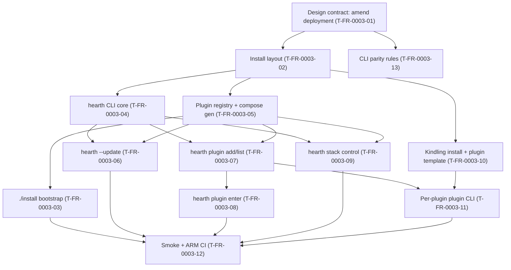

# FR-0003 — Work breakdown and DAG

**Canonical ticket bodies:** [`tickets.md`](tickets.md)  
**Global graph index:** [`docs/design/tickets-initial.md`](../../../docs/design/tickets-initial.md)

## Ticket table

| ID | Title (required — human-facing name) | Type | Deps (ticket IDs) | Summary of change (1–2 lines) | Suggested order group | Link |
|----|----------------------------------------|------|-------------------|--------------------------------|------------------------|------|
| T-FR-0003-01 | Design contract: amend deployment for Docker-on-Pi | Story | none | Add authoritative Docker-on-Pi profile to `docs/design/deployment.md`; resolve overlap with systemd story; stub image/CI gaps. | P0 | [details](tickets.md#t-fr-0003-01--design-contract-amend-deployment-for-docker-on-pi) |
| T-FR-0003-02 | Install layout: `heart/`, VERSION.json, README | Story | T-FR-0003-01 | Define directory tree, manifests, top-level minimalism; document env vars. | P0 | [details](tickets.md#t-fr-0003-02--install-layout-heart-versionjson-readme) |
| T-FR-0003-04 | `hearth` CLI core: argparse, paths, doctor, compose passthrough | Story | T-FR-0003-01, T-FR-0003-02 | Python CLI module + `bin/hearth` shim; `--version`, `doctor`, `compose --`. | P0 | [details](tickets.md#t-fr-0003-04--hearth-cli-core-argparse-paths-doctor-compose-passthrough) |
| T-FR-0003-05 | Plugin registry file + Compose fragment generation | Story | T-FR-0003-01, T-FR-0003-02 | `state/plugins.yaml` + generated compose for enabled plugins; project name policy. | P0 | [details](tickets.md#t-fr-0003-05--plugin-registry-file--compose-fragment-generation) |
| T-FR-0003-13 | Project rules: Hearth CLI parity (Cursor + Claude) | Chore | T-FR-0003-01 | Land stack-conventions + development-standards rule; reference in design doc. | P0 | [details](tickets.md#t-fr-0003-13--project-rules-hearth-cli-parity-cursor--claude) |
| T-FR-0003-10 | Kindling contract: `scripts/install` + `plugin` template | Story | T-FR-0003-01, T-FR-0003-02 | Document and template plugin bootstrap in Kindling repo or hearth mirror ticket. | P1 | [details](tickets.md#t-fr-0003-10--kindling-contract-scriptsinstall--plugin-template) |
| T-FR-0003-03 | `./install` bootstrap: Docker + layout + first `compose up` | Story | T-FR-0003-02, T-FR-0003-05 | Idempotent install script; Docker Engine setup on Pi; wire PATH shim. | P1 | [details](tickets.md#t-fr-0003-03--install-bootstrap-docker--layout--first-compose-up) |
| T-FR-0003-06 | `hearth --update` | Story | T-FR-0003-04, T-FR-0003-05 | Pull/rebuild policy; restart stack; plugin fetch updates optional flag. | P1 | [details](tickets.md#t-fr-0003-06--hearth---update) |
| T-FR-0003-07 | `hearth --plugin --add` and `list` | Story | T-FR-0003-04, T-FR-0003-05 | Git URL MVP; validate `tinder.toml`; register; regenerate compose. | P1 | [details](tickets.md#t-fr-0003-07--hearth---plugin---add-and-list) |
| T-FR-0003-09 | `hearth` stack control: start/stop/restart/status/logs | Story | T-FR-0003-04, T-FR-0003-05 | Thin wrappers over compose + health check. | P1 | [details](tickets.md#t-fr-0003-09--hearth-stack-control-startstoprestartstatuslogs) |
| T-FR-0003-08 | `hearth --plugin enter` | Story | T-FR-0003-07 | Subshell or `cd` with saved cwd for `plugin --exit`. | P2 | [details](tickets.md#t-fr-0003-08--hearth---plugin-enter) |
| T-FR-0003-11 | Per-plugin `plugin` executable: lifecycle + passthrough | Story | T-FR-0003-07, T-FR-0003-10 | Implement spec flags; shared library for common behavior. | P2 | [details](tickets.md#t-fr-0003-11--per-plugin-plugin-executable-lifecycle--passthrough) |
| T-FR-0003-12 | Smoke tests + ARM CI for install path | Story | T-FR-0003-03, T-FR-0003-06, T-FR-0003-08, T-FR-0003-09, T-FR-0003-11 | pytest or shell smoke; optional CI job; document Pi VAL. | P2 | [details](tickets.md#t-fr-0003-12--smoke-tests--arm-ci-for-install-path) |

## DAG (Mermaid)

Dependency edges cross ticket boundaries: **A → B** means **B** is blocked until **A** is **VAL-complete**.

## Map to tracker files

- Promoted sections live in **[`tickets.md`](tickets.md)**.
- Register rows in **[`tasks/ticket-progress.md`](../../ticket-progress.md)**.
- Extend **[`docs/design/tickets-initial.md`](../../../docs/design/tickets-initial.md)** triads + edges.

## `identify-frontier` check (after VAL starts)

Eligible parallel batches (once deps VAL-done):

- After **T02:** **T04**, **T05**, **T10**, **T13** can run in parallel.
- After **T04+T05:** **T06**, **T07**, **T09** in parallel.
- **T12** remains serial after all predecessors.

## Coordination notes

- **`T-FR-0001-10`** (bare-metal installer) and **`T-FR-0001-07`** (Kindling) may overlap; link handoffs when touching **`deploy/install.sh`** or Kindling upstream.
