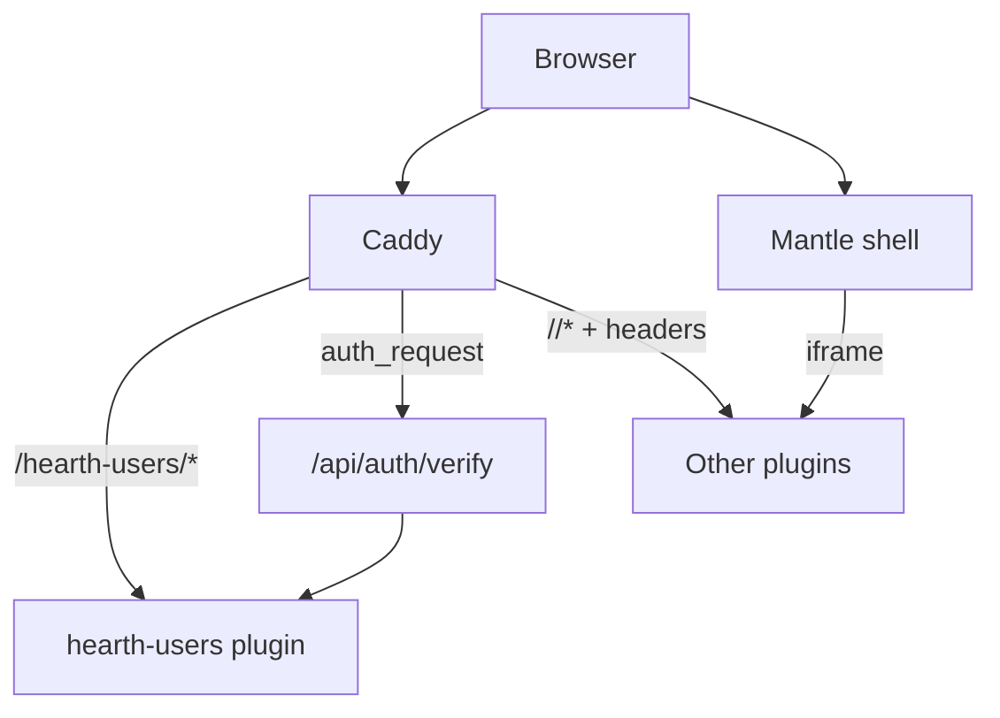

# FR-0004 — Design (level 0, skeleton)

## Purpose

Hearth is the **only public HTTPS origin** for the home LAN. Caddy terminates TLS and reverse-proxies to the hub (`/`, `/api/*`) and to each enabled plugin (`/<slug>/*`). **Authentication is enforced at the edge** via an `auth_request`-style subrequest; the **built-in `hearth-users` plugin** owns credentials, sessions, and verification. Other plugins **trust** identity injected by the proxy/hub and must not implement standalone login in the default Kindling template.

## Actors

| Actor | Role |
|-------|------|
| **Browser / PWA** | User; holds session cookie scoped to Hearth origin |
| **Caddy (edge)** | TLS, routing, `auth_request` to verify endpoint |
| **Hub API** | Registry, settings, orchestrates verify + header injection policy, marks built-in plugins |
| **`hearth-users` plugin** | Login UI, password hash, session CRUD, `/verify` for edge |
| **Other plugins** | Consume `X-Hearth-*` headers (backend) and `hearth.user` (frontend via Mantle) |
| **Kindling CLI** | Scaffolds plugins with trust middleware + docs |
| **Operator** | Enables/disables built-in users provider; future: points verify URL at external service |

## Public surfaces (skeleton)

| Surface | Kind | Contract (sketch) | Owner |
|---------|------|-------------------|--------|
| `GET/POST /hearth-users/login` | HTTP (plugin UI) | Login form; `POST` sets session cookie | `hearth-users` |
| `POST /hearth-users/logout` | HTTP | Clears session | `hearth-users` |
| `GET /hearth-users/api/session` | HTTP JSON | `{user_id, display_name, roles[]}` or `401` | `hearth-users` |
| `GET /hearth-users/api/verify` | HTTP | **200** + minimal body if session valid; **401** otherwise (Caddy `auth_request` target) | `hearth-users` |
| `GET /api/auth/verify` | HTTP (hub) | **Stable edge alias** — hub forwards to active auth provider (built-in or external URL from settings) | Hub |
| `PUT /api/settings/auth` | HTTP JSON | `{provider: "builtin"\|"external", external_verify_url?: url}` — **external** adapter stub in this FR | Hub |
| Request headers (to plugins) | HTTP | `X-Hearth-User-Id`, `X-Hearth-User-Sig` (HMAC), optional `X-Hearth-Roles` | Injected by Caddy/hub after verify |
| `hearth.user` postMessage | Shell ↔ iframe | `{id, name, roles}` per [`mantle-ui.md`](../../../docs/design/mantle-ui.md) | Mantle |
| `spark.call("hearth-users", …)` | Spark | `session.current`, `password.set` (admin), `provider.status` | `hearth-users` |
| Kindling `trust_hearth_user` middleware | Python/TS | Validates signature + populates request user; **fails closed** if headers missing on protected routes | Kindling template |

## Data in / out

| Input | Output | Storage |
|-------|--------|---------|
| Local password (setup / change) | Session cookie (`HttpOnly`, `Secure`, `SameSite=Lax`) | `var/hearth/plugins/hearth-users/` (plugin-owned SQLite) |
| Session id (cookie) | Verified user claims | Session table in plugin DB |
| Registry: built-in flag | Plugin cannot be uninstalled; disable = stop routing UI only if policy says so | `var/hearth/hearth.db` (hub) |

## Boundaries

- Plugins **must not** call each other’s login routes over HTTP (Spark-only for app-to-app).
- **Disable built-in users:** settings switch `provider=external` + `external_verify_url`; hub verify forwards there; same header injection contract. Full custom UI plugin is **follow-up FR**.

## Open questions

| ID | Question | Tag |
|----|----------|-----|
| Q1 | Does Web Push / VAPID stay in hub (`T-FR-0001-09`) or move under `hearth-users`? | **DESIGN-GAP** — default: hub keeps notify; users plugin only owns identity until amended |
| Q2 | Cookie name and path: site-wide `/` vs `/hearth-users/` only? | **DESIGN-GAP** — prefer site-wide `/` for single origin |
| Q3 | Signature algorithm and key rotation for `X-Hearth-User-Sig` | **DESIGN-GAP** — specify in L1 (`10-design-01-gateway-and-trust.md`) |
| Q4 | Minimum roles model for plugins (empty vs `["user"]`) | MVP: single role `user` |
