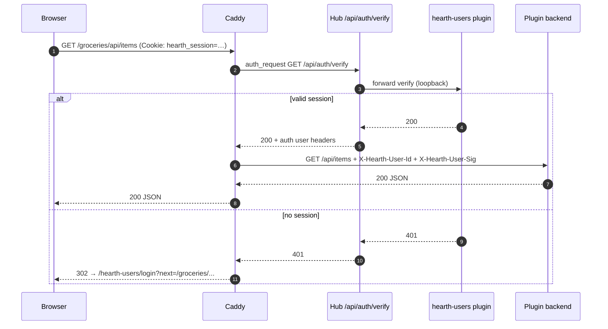

# FR-0004 — Design (L1): gateway, trust headers, Kindling

## Main flow — authenticated plugin request



## Unauthenticated browser navigation

- **API routes** (`/api/*`, plugin JSON): **401** JSON from hub unless `Accept` suggests HTML redirect is inappropriate.
- **HTML / SPA routes**: **302** to `/hearth-users/login?next=<encoded-path>`.
- **Public exceptions** (no auth): `/hearth-users/login`, static assets for login, hub health, VAPID public key if still hub-owned, Caddy ACME/internal paths.

## Trust header contract

| Header | Required | Semantics |
|--------|----------|-----------|
| `X-Hearth-User-Id` | yes, when authenticated | Stable id (MVP: `"local"`) |
| `X-Hearth-User-Sig` | yes | `HMAC-SHA256(secret, user_id + "\n" + timestamp)`; hub rejects stale timestamps (>60s) |
| `X-Hearth-User-Name` | optional | Display name for UI |
| `X-Hearth-Roles` | optional | Comma-separated; MVP: `user` |

Plugins **must** validate the signature with a secret delivered via environment (`HEARTH_USER_SIG_SECRET` from hub at plugin start), not trust raw `X-Hearth-User-Id` alone.

**Loopback-only injection:** Caddy sets these only on upstream requests to plugin backends bound to `127.0.0.1`. Plugins must not be reachable on LAN without passing through Caddy.

## Built-in plugin: `hearth-users`

| Property | Value |
|----------|--------|
| Slug | `hearth-users` |
| Route prefix | `/hearth-users/` |
| Built-in | `true` in registry — cannot uninstall; may be **disabled** only when `auth.provider=external` |
| UI | Mantle-themed login + password change + first-run set password |
| Data | `var/hearth/plugins/hearth-users/users.sqlite` |

Tinder sketch (promote to `docs/design/` on amendment):

```toml
[plugin]
slug = "hearth-users"
name = "Hearth Users"
version = "0.1.0"
hearth_min = "0.1.0"
builtin = true

[entrypoint]
backend = { kind = "python", module = "hearth_users.app:create_app", port_env = "HEARTH_PLUGIN_PORT" }
ui = { kind = "static", path = "web/dist" }

[capabilities.session]
methods = ["current"]
events = ["login", "logout"]

[permissions]
spark_call = ["hub.settings.auth"]
spark_publish = ["hearth-users.*"]
network = "loopback"

[ui.nav]
label = "Account"
icon = "user"
order = 999
```

Nav entry may be hidden on mobile tab bar (overflow / settings only) — **DESIGN-GAP** for Mantle nav rules for built-ins.

## Hub settings (auth provider)

```json
{
  "auth": {
    "provider": "builtin",
    "external_verify_url": null
  }
}
```

| `provider` | Behavior |
|------------|----------|
| `builtin` | `/api/auth/verify` delegates to `hearth-users`; plugin must be enabled |
| `external` | Hub `GET`s `external_verify_url` with incoming cookies/headers; maps 200 → same `X-Hearth-*` injection contract |

Disabling built-in without a working external URL **fails closed** (503 on verify). UI warns in dashboard settings.

## Kindling starter changes

Document in Kindling template README and generated plugin:

1. **No login page** in default template — link to `/hearth-users/login` only for dev docs.
2. **Python:** `kindling/hearth/trust.py` — FastAPI dependency `require_hearth_user()`.
3. **TypeScript (plugin backend if any):** same checks for Node template.
4. **React:** `useUser()` from `@kindling/mantle` only; never read cookies from plugin JS.
5. **`tinder.toml`:** `permissions.network = "loopback"` default; document that LAN exposure is via Caddy only.

## FR-0001 amendment note

[`T-FR-0001-09`](../../FR-0001-hearth-platform/tickets.md) should be split on implementation:

- **Moved to FR-0004:** password hash, session cookie, login UI, `/auth/verify`, Mantle login screen → `/hearth-users/`.
- **Stays in FR-0001-09 (or hub):** VAPID, `hub.notify.send`, push subscribe endpoints unless Q1 resolves otherwise.

Amend via `docs/ai-context.md` design amendment block when implementation starts.

## Error taxonomy (verify path)

| Code | Meaning |
|------|---------|
| 401 | No/invalid session — redirect or JSON per `Accept` |
| 403 | Session valid but plugin disabled for user |
| 503 | Auth provider misconfigured (external down, builtin disabled) |

## Security (MVP)

- Argon2id password hashing (same as prior architecture intent).
- Rate limit login attempts (plugin-owned).
- Session rotation on password change.
- Secrets: `HEARTH_USER_SIG_SECRET` in `var/hearth/secrets/` (hub distributes to plugins at start).
