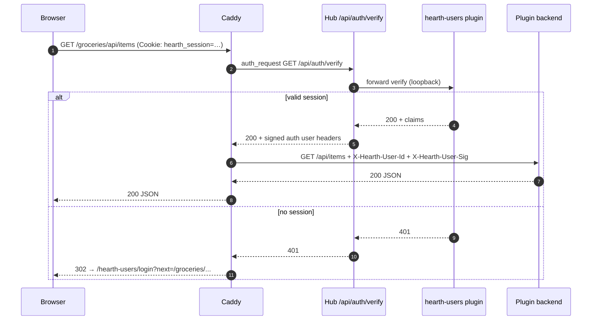

# FR-0004 — Design (L1): gateway, trust headers, Kindling

## Main flow — authenticated plugin request



## Unauthenticated browser navigation

- **API routes** (`/api/*`, plugin JSON): **401** JSON from hub unless `Accept` suggests HTML redirect is inappropriate.
- **HTML / SPA routes**: **302** to `/hearth-users/login?next=<encoded-path>`.
- **Public exceptions** (no auth): `/hearth-users/login`, static assets for login, hub health, VAPID public key if still hub-owned, Caddy ACME/internal paths.

## Trust header contract

| Header | Required | Semantics |
|--------|----------|-----------|
| `X-Hearth-User-Id` | yes, when authenticated | Stable per-user id generated by `hearth-users`; not a display name and not reused after deletion |
| `X-Hearth-User-Ts` | yes | Unix seconds when the hub verify alias generated the upstream identity headers |
| `X-Hearth-User-Sig` | yes | `HMAC-SHA256(secret, user_id + "\n" + ts + "\n" + method + "\n" + path)`; plugin middleware rejects stale timestamps (>60s) |
| `X-Hearth-User-Name` | optional | Display name for UI |
| `X-Hearth-Roles` | optional | Comma-separated roles; first local account is `admin,user`, additional accounts default to `user` |

Plugins **must** validate the signature with a secret delivered via environment (`HEARTH_USER_SIG_SECRET` from hub at plugin start), not trust raw `X-Hearth-User-Id` alone.

**Header source and stripping:** `/api/auth/verify` is the only component that creates `X-Hearth-User-*` headers. Caddy must strip any inbound `X-Hearth-*` request headers from the browser, call the verify alias, then copy only the alias response headers to the plugin upstream. External auth providers return claims to the hub alias; the hub still normalizes and signs the upstream headers.

**Loopback-only injection:** Caddy forwards these only on upstream requests to plugin backends bound to `127.0.0.1` or container-internal networks. Plugins must not be reachable on LAN without passing through Caddy.

## Built-in plugin: `hearth-users`

| Property | Value |
|----------|--------|
| Slug | `hearth-users` |
| Route prefix | `/hearth-users/` |
| Source path | `apps/builtin/hearth-users/` in Hearth; external apps still live outside the hub repo or as submodules |
| Built-in | `true` in registry — cannot uninstall; may be **disabled** only when `auth.provider=external` |
| UI | Mantle-themed first-admin setup, username/password login, password change, and admin user management |
| Data | `var/hearth/plugins/hearth-users/users.sqlite` (`users`, `sessions`, `audit_events`; migration from the original single `local` user required) |

Tinder sketch (promote to `docs/design/` on amendment):

```toml
[plugin]
slug = "hearth-users"
name = "Hearth Users"
version = "0.1.0"
hearth_min = "0.1.0"
builtin = true

[entrypoint]
backend = { kind = "python", module = "hearth_users.app:create_app", port_env = "HEARTH_PLUGIN_PORT" }
ui = { kind = "static", path = "web/dist" }

[capabilities.session]
methods = ["current"]
events = ["login", "logout"]

[permissions]
spark_call = ["hub.settings.auth"]
spark_publish = ["hearth-users.*"]
network = "loopback"

[ui.nav]
label = "Account"
icon = "user"
order = 999
```

Nav entry may be hidden on mobile tab bar (overflow / settings only) — **DESIGN-GAP** for Mantle nav rules for built-ins.

## Hub settings (auth provider)

```json
{
  "auth": {
    "provider": "builtin",
    "external_verify_url": null
  }
}
```

| `provider` | Behavior |
|------------|----------|
| `builtin` | `/api/auth/verify` delegates to `hearth-users`; plugin must be enabled |
| `external` | Hub `GET`s `external_verify_url` with incoming cookies/headers; maps 200 → same `X-Hearth-*` injection contract |

Disabling built-in without a working external URL **fails closed** (503 on verify). UI warns in dashboard settings.

## Multi-user local account model

FR-0004 local identity is multi-user:

- First-run setup creates the first account with `admin,user` roles.
- Login requires a username (or future email alias) plus password; password-only login is not acceptable for a multi-user Hearth.
- Users are stored with: stable opaque `id`, unique normalized `username`, `display_name`, `roles`, `disabled`, `password_hash`, `created_at`, `updated_at`, and nullable `last_login_at`.
- The original single-account schema (`id = "local"`, display name `Local user`) must migrate in place to an admin account without breaking existing sessions more than necessary. If the prior account has no username, use `local` as the initial username and let the operator rename it in user management. The migrated account keeps the old id only as a compatibility alias if existing sessions require it; new installs generate opaque ids.
- Sessions bind to a concrete user id. Verify, Spark `session.current`, audit logs, Mantle `useUser()`, and gateway headers must all report the same user id/display name/roles.
- Account management is admin-only in the built-in provider: list users, create user, disable user, reset password, and update display name/roles. The final enabled admin cannot be disabled or demoted.
- User ids are stable opaque ids. Usernames are unique, normalized for lookup, and safe to change only through an explicit admin flow.

### Migration plan

1. Add the multi-user tables while preserving the existing session cookie name and provider route prefixes.
2. If the old single-account row exists, create one enabled admin user from it: `username = "local"` unless a stored username already exists, `display_name = "Local user"` unless a display name already exists, and `roles = ["admin", "user"]`.
3. Repoint sessions to the migrated user where the old session store can be mapped safely. Sessions that cannot be mapped fail closed and require login.
4. For a fresh install, `/hearth-users/login` shows setup mode and creates the first enabled admin. After the first user exists, setup mode is unavailable.
5. Later created users default to `roles = ["user"]`, `disabled = false`, and no admin powers until an enabled admin grants them.
6. Admin mutations must write audit events and enforce final-admin safety before committing the change.

### Single-user statement classification

| Statement / location | Classification | Action |
|----------------------|----------------|--------|
| FR-0004 `10-design-00-skeleton.md` described one local credential input and password-change Spark method. | Updated | The L0 skeleton now describes first-admin setup, username/password login, account fields, admin user-management operations, and multi-user session claims. |
| FR-0004 `10-design-01-gateway-and-trust.md` still referenced the old `id = "local"` / `Local user` single account. | Updated | This L1 doc now treats that value only as migration input; new installs use stable opaque ids and normalized usernames. |
| FR-0004 `tickets.md` mentions "single-user statement", "single-user table/session data", and hardcoded `local` assumptions. | Ticketed | These phrases are intentional ticket language: `T-FR-0004-11` audits docs, `T-FR-0004-12` migrates schema/session data, and `T-FR-0004-14` removes runtime claim assumptions. |
| `docs/design/architecture/overview.md` still listed multi-user role-based permissions as an MVP non-goal. | Updated | The non-goal now excludes fine-grained per-plugin authorization, while FR-0004 owns baseline local multi-user accounts and `admin` / `user` roles. |
| `docs/design/deployment.md` stored "local user password hash" in secrets and prompted for a local user password during install. | Updated | Deployment now describes auth bootstrap secrets and first-admin setup through `hearth-users`. |
| `docs/design/notifications.md` says "single-user home scale only" for push fan-out. | Intentionally deferred | The statement scopes notification fan-out capacity, not FR-0004 identity. `T-FR-0004-16` will refresh operator/compliance docs if multi-user E2E changes notification guidance. |
| `docs/design/satellite-repos/ember.md` defers group identity / household sharing until after single-user remote access. | Intentionally deferred | Ember remote sharing is outside FR-0004. FR-0004 only changes local Hearth identity behind the gateway. |

**Follow-up FR:** A complete custom user service adapter remains outside FR-0004. A later FR should specify the service lifecycle, operator onboarding, health checks, OIDC/social-login adapters, and any replacement UI for `/hearth-users/login`; this ticket only records `provider=external` plus a verify URL and preserves the same hub-normalized header contract.

## Kindling starter changes

Document in Kindling template README and generated plugin:

1. **No login page** in default template — link to `/hearth-users/login` only for dev docs.
2. **Python:** `kindling/hearth/trust.py` — FastAPI dependency `require_hearth_user()`.
3. **TypeScript (plugin backend if any):** same checks for Node template.
4. **React:** `useUser()` from `@kindling/mantle` only; never read cookies from plugin JS.
5. **`tinder.toml`:** `permissions.network = "loopback"` default; document that LAN exposure is via Caddy only.
6. **Child-repo compliance changelog:** every Kindling contract/template change must update a dense, AI-readable changelog entry that tells existing child plugin repos what to change, how to detect drift, and how to verify compliance.

## FR-0001 amendment note

[`T-FR-0001-09`](../../FR-0001-hearth-platform/tickets.md) should be split on implementation:

- **Moved to FR-0004:** password hash, session cookie, login UI, `/auth/verify`, Mantle login screen → `/hearth-users/`.
- **Stays in FR-0001-09 (or hub):** VAPID, `hub.notify.send`, push subscribe endpoints unless Q1 resolves otherwise.

Amend via `docs/ai-context.md` design amendment block when implementation starts.

## Error taxonomy (verify path)

| Code | Meaning |
|------|---------|
| 401 | No/invalid session — redirect or JSON per `Accept` |
| 403 | Session valid but plugin disabled for user |
| 503 | Auth provider misconfigured (external down, builtin disabled) |

## Security (MVP)

- Argon2id password hashing per user (same as prior architecture intent).
- Rate limit login attempts (plugin-owned).
- Session rotation on password change.
- Secrets: `HEARTH_USER_SIG_SECRET` in `var/hearth/secrets/` (hub distributes to plugins at start).
