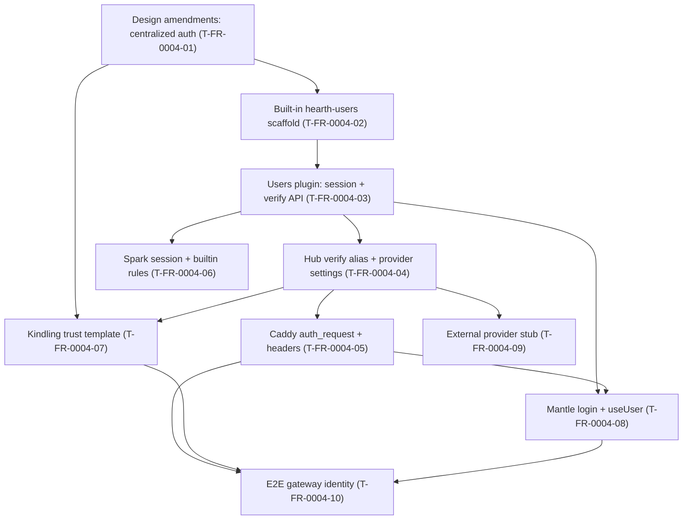

# FR-0004 — Work breakdown and DAG

> **Feature status: `parked`** — no implementation until FR-0002 Pi certificate testing (**`T-FR-0002-01` VAL**, **`T-FR-0002-04` VAL**) and FR-0001 initial UI (**`T-FR-0001-04` VAL**). See [`README.md`](README.md).

## Ticket table

| ID | Title | Type | Deps | Summary | Group |
|----|-------|------|------|---------|-------|
| T-FR-0004-01 | Design amendments: centralized auth architecture | Story | none | Amend `docs/design/architecture/overview.md`, deployment, plugin-contract (`builtin`), mantle-ui; FR-0001-09 split note | P0 |
| T-FR-0004-02 | Built-in hearth-users plugin scaffold | Story | T-FR-0004-01 | `apps/hearth-users/`, tinder.toml with `builtin=true`, placeholder UI | P0 |
| T-FR-0004-03 | Users plugin: password, session, verify API | Story | T-FR-0004-02 | Argon2id, SQLite, login/logout, `/api/verify` for edge | P0 |
| T-FR-0004-04 | Hub auth verify alias and provider settings | Story | T-FR-0004-03 | `/api/auth/verify`, `auth.provider` settings, forward to builtin/external | P1 |
| T-FR-0004-05 | Caddy auth_request and header injection | Story | T-FR-0004-04 | Regenerate routes: subrequest + `X-Hearth-*` on plugin upstreams | P1 |
| T-FR-0004-06 | Spark session capabilities and builtin registry rules | Story | T-FR-0004-03 | `hearth-users.session.*`; hub cannot uninstall builtin | P1 |
| T-FR-0004-07 | Kindling template: trust middleware and no local login | Story | T-FR-0004-01, T-FR-0004-04 | `require_hearth_user`, docs, template tests | P2 |
| T-FR-0004-08 | Mantle shell: login via hearth-users and useUser contract | Story | T-FR-0004-03, T-FR-0004-05 | Remove hub login routes; redirect unauth; `hearth.user` payload | P2 |
| T-FR-0004-09 | External auth provider stub and operator settings UI | Story | T-FR-0004-04 | `provider=external` + verify URL; fail-closed; dashboard warning | P2 |
| T-FR-0004-10 | E2E: plugin trusts gateway identity | Story | T-FR-0004-05, T-FR-0004-07, T-FR-0004-08 | Fixture plugin + Playwright/pytest: header auth, login redirect | P3 |

**Cross-feature gate (not ticket deps):** Implementation VAL on proxy integration assumes **Caddy generation** from FR-0001 **`T-FR-0001-05`** or FR-0003 proxy work exists — track in ticket notes, not as hard `T-FR-0001-xx` deps to avoid blocking design.

## DAG (Mermaid)

## Parallelization notes

| Wave | Tickets | Rationale |
|------|---------|-----------|
| 1 | T-FR-0004-01 | Doc contract only |
| 2 | T-FR-0004-02 | Scaffold after design |
| 3 | T-FR-0004-03 | Core plugin |
| 4 | T-FR-0004-04, T-FR-0004-06 | Hub + Spark after plugin API |
| 5 | T-FR-0004-05, T-FR-0004-09, T-FR-0004-07 (partial) | Edge + Kindling docs |
| 6 | T-FR-0004-08 | Shell integration |
| 7 | T-FR-0004-10 | Capstone E2E |

## Map to tracker

- Canonical bodies: [`tickets.md`](tickets.md)
- Register: [`TICKET-SOURCES.md`](../TICKET-SOURCES.md), [`docs/design/tickets-initial.md`](../../../docs/design/tickets-initial.md), [`tasks/ticket-progress.md`](../../ticket-progress.md)
