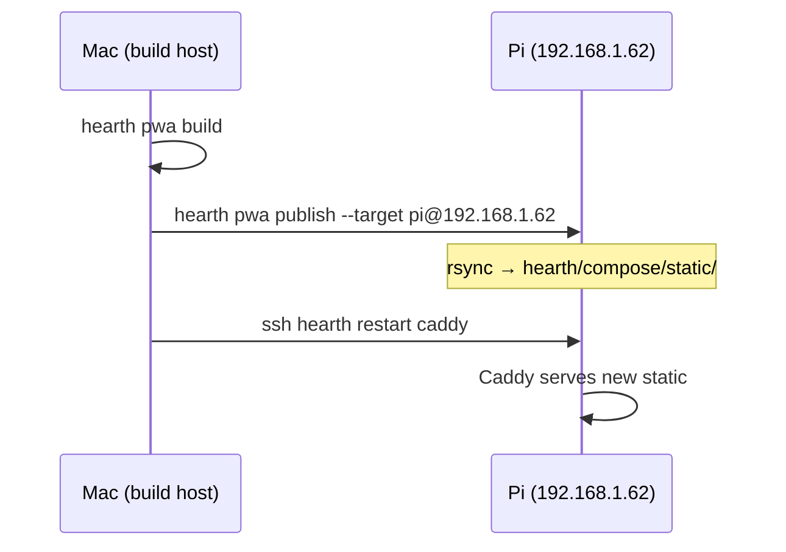

# FR-0005 — Design (level 0, skeleton)

## Purpose

Define operator contracts so **frontend (and optionally hub) artifacts are produced on a fast build host (Mac)** and **applied on the Pi** without running slow ARM `npm` or image builds during routine updates.

## Actors

- **Mac operator** — runs `hearth pwa build` and `hearth pwa publish` (or `./develop` equivalents) against a local git checkout.
- **Pi operator** — receives published static (and optional images); runs `hearth restart caddy`, `hearth status`, `hearth --update` (git-only on Pi when images are preloaded).
- **`hearth` CLI** — extended publish subcommands; reuses `ResolvedInstall` for local paths and SSH target configuration.

## Public surfaces (skeleton)

| Surface | Kind | Contract (signature / schema sketch) | Owner |
|---------|------|----------------------------------------|-------|
| `hearth pwa build` | CLI (existing) | Unchanged: build into **local** `hearth/compose/static/` when install root is on Mac, or into install tree under `HEARTH_INSTALL_ROOT`. | T-FR-0005-02 |
| `hearth pwa publish` | CLI (new) | `hearth pwa publish --target <ssh> [--install-remote PATH] [--build] [--dry-run]` — rsync local `compose/static/` to remote `hearth/compose/static/`; optional `--build` runs local `pwa build` first. | T-FR-0005-02 |
| Publish config | Env / file | `HEARTH_PUBLISH_TARGET` (e.g. `pi@192.168.1.62`); optional `HEARTH_PUBLISH_INSTALL` remote install root (parent of `hearth/`). | T-FR-0005-02 |
| Remote-build profile | Doc | New subsection in **`docs/design/deployment.md`**: when to build on Mac vs Pi; sequence diagram Mac → rsync → Pi restart. | T-FR-0005-01 |
| `hearth image build` | CLI (optional v0.1) | `hearth image build [--platform linux/arm64] [--tag TAG]` — `docker buildx` for hub (and later plugins) from `HEARTH_REPO_ROOT`. | T-FR-0005-03 |
| `hearth image publish` | CLI (optional v0.1) | `hearth image publish --target <ssh> [--tag TAG]` — `docker save` on Mac, `scp`, `docker load` on Pi; Compose uses `image:` override. | T-FR-0005-03 |
| Operator guide | Doc | **`SETUP.md`** section: “Mac build host + Pi runtime” with copy-paste commands. | T-FR-0005-04 |

### `hearth pwa publish` behavior (normative)

1. Resolve **local** install: `HEARTH_INSTALL_ROOT` / `--install-root` (same as today).
2. Ensure **`hearth/compose/static/`** exists and contains a prior `hearth pwa build` (or run build when `--build`).
3. Resolve **remote** static directory: `{remote_install_root}/hearth/compose/static` (default remote install root from env or explicit `--install-remote` in v0).
4. Run **`rsync -avz --delete`** over SSH to remote static dir.
5. Print post-step: on Pi run `hearth restart caddy` (and verify `curl` health).

**Safety:** `--dry-run` passes through to rsync; never delete remote secrets or `var/` — static subtree only.

### Pi “no build” policy (normative)

| Operation | On Pi (remote-build profile) |
|-----------|------------------------------|
| UI update after `git pull` | **Do not** run `hearth pwa build` on Pi; run `hearth pwa publish` from Mac |
| Hub code update | **v0:** `git pull` on Pi + pre-published image **or** accept one-time `compose build` until T-FR-0005-03 lands |
| Caddy / TLS | Unchanged: `hearth restart caddy`, `hearth ca-export` on Pi |

## Data in / out

| Input | Output | Storage |
|-------|--------|---------|
| Local `apps/hub/web` sources | `dist/` then `hearth/compose/static/` | Mac checkout + Mac install tree |
| rsync over SSH | Remote `hearth/compose/static/` | Pi install tree |
| `docker buildx` (optional) | `hearth-hub:<tag>` tarball | Mac temp; Pi Docker image store |

## Sequencing vs existing design

- Amends **`docs/design/deployment.md`** Docker profile with **Remote build (Mac → Pi)** — does not remove on-Pi `hearth pwa build` (still valid for Pi-only operators).
- Complements **DG-D1** (published ARM images): T-FR-0005-03 is a **private, operator-local** image path until a registry exists.

## Open questions

- **Default remote path discovery:** v0 may require explicit `--install-remote` / `HEARTH_PUBLISH_INSTALL` rather than probing Pi `VERSION.json` over SSH.
- **Plugin static/assets:** plugins without web UI are unaffected; plugin containers with future frontends need a separate publish contract (**REFINEMENT**).

