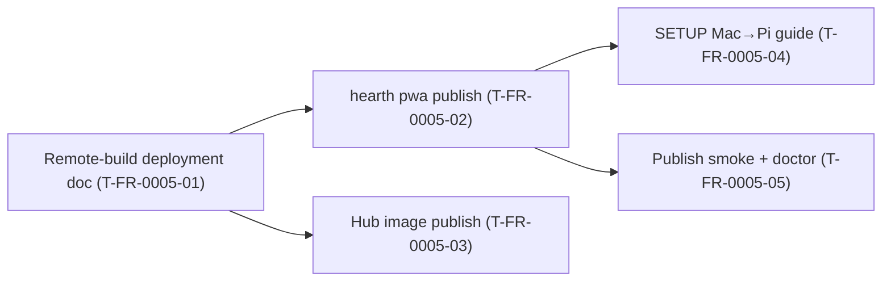

# FR-0005 — Tickets DAG (draft)

| Ticket | Title | Type | Deps | Summary |
|--------|-------|------|------|---------|
| T-FR-0005-01 | Remote-build profile in deployment.md | design | none | Document Mac → Pi publish flow; Pi “no npm build” policy |
| T-FR-0005-02 | `hearth pwa publish` (rsync static to Pi) | feature | T-FR-0005-01 | SSH/rsync from Mac install `compose/static/` to Pi |
| T-FR-0005-03 | Hub image build and publish (arm64 bundle) | feature | T-FR-0005-01 | Optional: buildx on Mac, `docker load` on Pi, compose image override |
| T-FR-0005-04 | SETUP.md Mac-build / Pi-runtime operator guide | docs | T-FR-0005-02 | Replace “build on Pi” as default with publish workflow |
| T-FR-0005-05 | Publish smoke test and doctor hints | test | T-FR-0005-02 | Dry-run rsync; `hearth doctor` notes when publish env missing |

**Order groups:** P0 = 01 → 02 → 04/05; P1 = 03 (hub images, parallel after 01).

