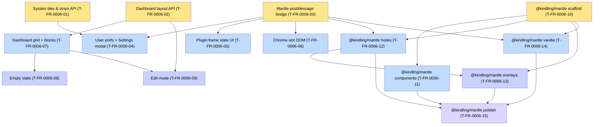

# FR-0006 — Tickets DAG (draft)

Canonical ticket bodies in [`tickets.md`](tickets.md). This file is the planning view + Mermaid DAG; promote rows here into `tickets.md` `### T-FR-0006-xx` sections.

## Ticket table

| Id | Title | Type | Deps | Order | Summary |
|----|-------|------|------|-------|---------|
| T-FR-0006-01 | System tiles & strips API | impl | none | P0 | `GET /api/system/{tiles,strips}` + hide/dismiss; DF-U1, DF-U2. |
| T-FR-0006-02 | Dashboard layout API | impl | none | P0 | `GET/PUT /api/dashboard/layout`; collision check; default-layout generator. |
| T-FR-0006-03 | Mantle postMessage bridge | impl | none | P0 | Inbound listener (title/toast/haptic/chrome.*) + outbound pushes (theme/user/online/frame.state). DG-U6/U7/U9. |
| T-FR-0006-04 | User preferences API + Settings modal | impl | 01 (route conventions) | P1 | `GET/PUT /api/user/preferences` + Settings modal (Theme/Plugins/System tiles/Diagnostics/Sign out). DG-U8, RW-U2. |
| T-FR-0006-05 | Plugin frame state UI | impl | 03 | P1 | Mounted/Loading/Slow/Error/Offline scrims + shell→plugin `hearth.frame.state` push. DG-U7. |
| T-FR-0006-06 | Chrome slot DOM + rendering | impl | 03 | P1 | DOM zones for `[ui.chrome].{top,bottom}`; ChromeButton/Menu rendering; overflow menu; per-slot caps. DG-U6. |
| T-FR-0006-07 | Dashboard grid + block primitives | impl | 02 | P1 | Grid CSS per DG-U5; AppShortcut/System/Strip blocks; default layout fetch+render. RW-U1. |
| T-FR-0006-08 | Empty state | impl | 07 | P2 | DG-U4 centered empty state with Open Settings CTA. |
| T-FR-0006-09 | Edit mode | impl | 07, 02 | P2 | Long-press/Edit button entry; jiggle/× badge/drag/resize; collisions (DG-U3); save via PUT. DG-U2, RW-U4. |
| T-FR-0006-10 | `@kindling/mantle` package scaffold | impl | none | P0 | `packages/mantle/` with tsup/vite build, tokens.css, types.ts, package.json (private→publishable). |
| T-FR-0006-11 | `@kindling/mantle` base components | impl | 10 | P1 | `<Page>` `<PageHeader>` `<Card>` `<Section>` `<List>` `<EmptyState>` `<Button>` `<IconButton>` `<Input>` `<TextArea>` `<Select>` `<Switch>`. |
| T-FR-0006-12 | `@kindling/mantle` hooks | impl | 10, 03 (contract types) | P1 | `useMantle`, `useTheme`, `useUser`, `useChromeSlot`, `useHaptics`, `useNotifications`, `useSpark` (stub). |
| T-FR-0006-13 | `@kindling/mantle` overlays | impl | 10, 12 | P2 | `<Sheet>` `<Toast>` `<Dialog>` routed via postMessage; Toast=stub for DG-U11. |
| T-FR-0006-14 | `@kindling/mantle` vanilla bridge | impl | 10, 03 | P1 | `vanilla/theme.ts` + `vanilla/chrome.ts` for non-React plugins. |
| T-FR-0006-15 | `@kindling/mantle` publish | release | 10, 11, 12, 13, 14 | P3 | Versioning, README, CHANGELOG, `npm publish --access=public` workflow. |

## Mermaid DAG

## Parallel waves (illustrative)

| Wave | Tickets eligible after prior wave | Comment |
|------|------------------------------------|---------|
| **W0** | T01, T02, T03, T10 | Four parallel-capable starts (P0). |
| **W1** | T04, T05, T06, T07, T11, T12, T14 | After W0 lands; broad parallel. |
| **W2** | T08, T09, T13 | After W1. |
| **W3** | T15 | Single integrator. |
