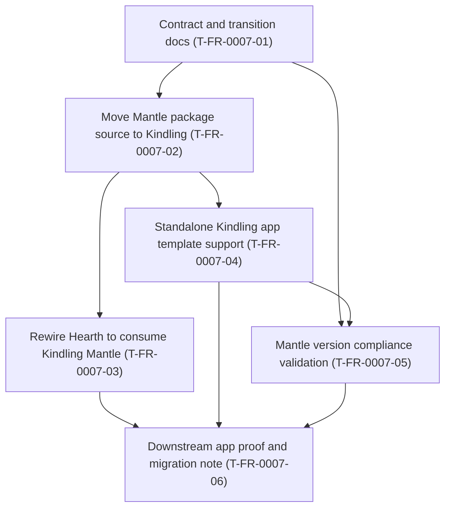

# FR-0007 - Work breakdown and DAG

## Ticket table

| ID | Title (required - human-facing name) | Type | Deps (ticket IDs) | Summary of change (1-2 lines) | Suggested order group | Link |
|----|--------------------------------------|------|--------------------|-------------------------------|-----------------------|------|
| T-FR-0007-01 | Contract and transition docs | Story | none | Amend the Kindling design with the source-of-truth transition and compatibility rules. | P0 foundation | [details](tickets.md#t-fr-0007-01--contract-and-transition-docs) |
| T-FR-0007-02 | Move Mantle package source to Kindling | Story | T-FR-0007-01 | Relocate `@kindling/mantle` source, tests, package metadata, and changelog into Kindling. | P1 package move | [details](tickets.md#t-fr-0007-02--move-mantle-package-source-to-kindling) |
| T-FR-0007-03 | Rewire Hearth to consume Kindling Mantle | Story | T-FR-0007-02 | Update Hearth dependency/workspace resolution so hub web imports the Kindling-owned package. | P1 host integration | [details](tickets.md#t-fr-0007-03--rewire-hearth-to-consume-kindling-mantle) |
| T-FR-0007-04 | Standalone Kindling app template support | Story | T-FR-0007-02 | Update Kindling templates and dev scripts so app repos run standalone while using real Mantle. | P1 templates | [details](tickets.md#t-fr-0007-04--standalone-kindling-app-template-support) |
| T-FR-0007-05 | Mantle version compliance validation | Story | T-FR-0007-01, T-FR-0007-04 | Validate plugin/app Mantle compatibility against the target Hearth/Kindling contract. | P2 validation | [details](tickets.md#t-fr-0007-05--mantle-version-compliance-validation) |
| T-FR-0007-06 | Downstream app proof and migration note | Story | T-FR-0007-03, T-FR-0007-04, T-FR-0007-05 | Prove one standalone app/plugin path and write downstream changelog/handoff guidance. | P3 proof | [details](tickets.md#t-fr-0007-06--downstream-app-proof-and-migration-note) |

**Parallelization rule:** After **Contract and transition docs** finishes, **Move Mantle package source to Kindling** is the serialization point. Once package ownership is moved, **Rewire Hearth to consume Kindling Mantle** and **Standalone Kindling app template support** can run in parallel if they do not edit the same package files.

## DAG (Mermaid)

## Map to feature `tickets.md` + global index

- Canonical tickets: [`tickets.md`](tickets.md).
- Global DAG: [`docs/design/tickets-initial.md`](../../../docs/design/tickets-initial.md).
- Progress tracker: [`tasks/ticket-progress.md`](../../ticket-progress.md).

## Suggested `identify-frontier` check

After this lands, run `/identify-frontier`. The expected first eligible ticket is **Contract and transition docs** ([`T-FR-0007-01`](tickets.md#t-fr-0007-01--contract-and-transition-docs)).
